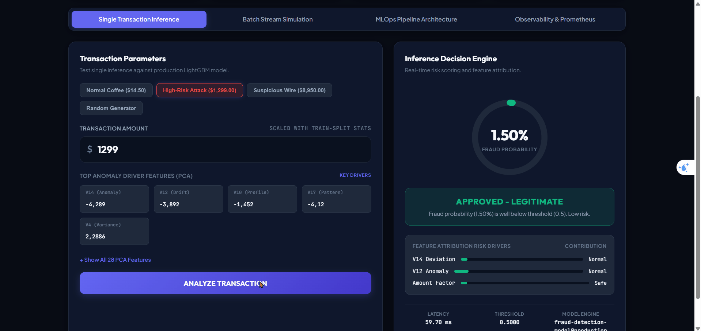
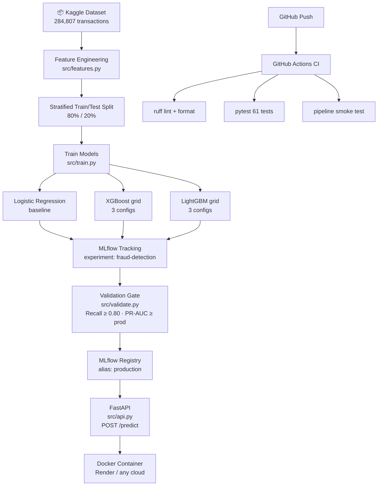

# 🔍 MLOps Fraud Detection Pipeline

[](https://github.com/anhquan1111/mlops-fraud-detection/actions/workflows/ci.yml)
[](https://www.python.org/downloads/release/python-3120/)
[](https://github.com/astral-sh/ruff)
[](LICENSE)
[](https://mlflow.org/)
[](https://fastapi.tiangolo.com/)
[](https://mlops-fraud-detection-g7c7.onrender.com)

End-to-end MLOps pipeline for **real-time credit card fraud detection** on a severely imbalanced dataset (~0.17% fraud). Built with LightGBM, MLflow experiment tracking, FastAPI serving, Docker, and GitHub Actions CI/CD.

🌐 **Live Interactive Dashboard:** [https://mlops-fraud-detection-g7c7.onrender.com](https://mlops-fraud-detection-g7c7.onrender.com)  
⚡ **Swagger API Docs:** [https://mlops-fraud-detection-g7c7.onrender.com/docs](https://mlops-fraud-detection-g7c7.onrender.com/docs)

---

## 🎬 Live Interactive Demo



---

## 📊 Results at a Glance

| Model | PR-AUC | Recall | Precision | F1 |
|-------|--------|--------|-----------|-----|
| Logistic Regression (baseline) | 0.7156 | 0.9184 | 0.8571 | 0.8867 |
| XGBoost default | 0.8445 | 0.8163 | 0.9302 | 0.8696 |
| XGBoost deep | 0.8391 | 0.7959 | 0.9286 | 0.8571 |
| XGBoost regularized | 0.8373 | 0.7959 | 0.9070 | 0.8475 |
| LightGBM default | 0.8657 | 0.8367 | 0.9114 | 0.8725 |
| LightGBM regularized | 0.8700 | 0.8469 | 0.9130 | 0.8787 |
| **LightGBM large** ⭐ | **0.8770** | **0.8571** | **0.8485** | **0.8528** |

> ⭐ **Champion model** — `lgbm_large` — registered in MLflow Registry under alias `production`.
>
> **Success thresholds**: Recall ≥ 0.80 ✅ · Precision ≥ 0.50 ✅ · PR-AUC > Baseline (0.7156) ✅

---

## 🏗️ Architecture



### Pipeline Components

| Component | File | Purpose |
|-----------|------|---------|
| Feature engineering | `src/features.py` | Load CSV, scale Amount, drop Time |
| Training pipeline | `src/train.py` | 7 MLflow runs: 1 LR + 3 XGB + 3 LGBM |
| Evaluation | `src/evaluate.py` | PR-AUC, Recall, Precision, F1, ROC-AUC |
| Validation gate | `src/validate.py` | New model vs production gating logic |
| REST API | `src/api.py` | FastAPI: `/predict` + `/predict/batch` |
| Config | `src/config.py` | All paths, thresholds, hyperparameters |

---

## 🚀 Quick Start

### Prerequisites

- Python 3.12+
- [uv](https://docs.astral.sh/uv/) — fast Python package manager
- Kaggle account (for dataset download)

### 1. Install dependencies

```bash
git clone https://github.com/anhquan1111/mlops-fraud-detection.git
cd mlops-fraud-detection

uv sync            # production dependencies
uv sync --extra dev  # + pytest, ruff
```

### 2. Download dataset

```bash
# Option A: Kaggle CLI
kaggle datasets download -d mlg-ulb/creditcardfraud -p data/raw/ --unzip

# Option B: Manual download from
# https://www.kaggle.com/datasets/mlg-ulb/creditcardfraud
# → place creditcard.csv in data/raw/
```

### 3. Run training pipeline

```bash
uv run python src/train.py
```

Runs 7 MLflow experiments (1 baseline + 3 XGBoost + 3 LightGBM) and prints a comparison table.

### 4. Register best model

```bash
uv run python scripts/select_best_model.py
```

Registers the best-performing model to MLflow Registry with alias `production`.

### 5. Launch API server

```bash
uv run uvicorn src.api:app --reload --port 8000
```

Open [http://localhost:8000/docs](http://localhost:8000/docs) for interactive Swagger UI.

### 6. View MLflow dashboard

```bash
uv run mlflow ui
```

Open [http://localhost:5000](http://localhost:5000) to compare all experiment runs.

---

## 📡 API Reference

### `POST /predict`

Predict fraud probability for a single transaction.

**Request:**

```bash
curl -X POST http://localhost:8000/predict \
  -H "Content-Type: application/json" \
  -d '{
    "V1": -1.3598, "V2": -0.0728, "V3": 2.5363, "V4": 1.3782,
    "V5": -0.3383, "V6": 0.4624, "V7": 0.2396, "V8": 0.0987,
    "V9": 0.3638, "V10": 0.0908, "V11": -0.5516, "V12": -0.6178,
    "V13": -0.9914, "V14": -0.3112, "V15": 1.4682, "V16": -0.4704,
    "V17": 0.2080, "V18": 0.0258, "V19": 0.4040, "V20": 0.2514,
    "V21": -0.0183, "V22": 0.2778, "V23": -0.1105, "V24": 0.0669,
    "V25": 0.1285, "V26": -0.1891, "V27": 0.1336, "V28": -0.0211,
    "Amount": 149.62
  }'
```

**Response:**

```json
{
  "fraud_probability": 0.003421,
  "is_fraud": false,
  "threshold": 0.5,
  "model_name": "fraud-detection-model@production"
}
```

### `POST /predict/batch`

Predict fraud for up to 100 transactions in one call.

```bash
curl -X POST http://localhost:8000/predict/batch \
  -H "Content-Type: application/json" \
  -d '[{ "V1": -1.36, ..., "Amount": 149.62 }, { ... }]'
```

**Response:**

```json
{
  "predictions": [{ "fraud_probability": 0.003421, "is_fraud": false, ... }],
  "count": 2,
  "fraud_count": 0
}
```

### `GET /health`

```bash
curl http://localhost:8000/health
```

```json
{
  "status": "healthy",
  "model_loaded": true,
  "model_source": "mlflow_registry",
  "uptime_seconds": 42.1
}
```

---

## 🐳 Docker

### Build & run locally

```bash
# 1. Export model to models/baseline_lr.pkl first (if using local pkl strategy)
uv run python scripts/export_model.py

# 2. Build Docker image
docker build -t fraud-detection .

# 3. Run container
docker run -p 8000:8000 fraud-detection
```

### Deploy to Render

1. Fork this repo
2. Create a new **Web Service** on [Render](https://render.com/)
3. Point to your fork — Render will auto-detect `render.yaml`
4. Add env vars if needed (`HF_REPO_ID`, `HF_TOKEN` for HuggingFace model loading)
5. Deploy — health check endpoint: `/health`

> ⚠️ **Model file**: `models/*.pkl` is gitignored. Before deploying to Render, either:
> - Use HuggingFace Hub strategy (set `HF_REPO_ID` env var), or
> - Use `scripts/export_model.py` + attach to build process

---

## 🧪 Testing & Linting

```bash
# Run all tests (61 tests)
uv run pytest tests/ -v

# Lint check
uv run ruff check src/ tests/ scripts/

# Auto-format
uv run ruff format src/ tests/ scripts/
```

### Test coverage

| Test file | Tests | Scope |
|-----------|-------|-------|
| `tests/test_features.py` | 16 | Feature engineering, data loading, split |
| `tests/test_evaluate.py` | 14 | Metrics computation, edge cases |
| `tests/test_validate.py` | 11 | Validation gate logic, promotion decisions |
| `tests/test_api.py` | 20 | FastAPI endpoints, request/response validation |

---

## 📁 Project Structure

```
mlops-fraud-detection/
├── src/                      # Source code
│   ├── __init__.py
│   ├── config.py             # Central config: paths, hyperparameters, thresholds
│   ├── features.py           # Data loading, preprocessing, train/test split
│   ├── train.py              # Full 7-run experiment pipeline
│   ├── evaluate.py           # Metrics: PR-AUC, Recall, Precision, F1, ROC-AUC
│   ├── validate.py           # Model validation gate (new vs production)
│   └── api.py                # FastAPI app: /predict, /predict/batch, /health
├── scripts/
│   ├── export_model.py       # Export MLflow model → local .pkl for Docker
│   ├── register_model.py     # Register a run to MLflow Registry
│   └── select_best_model.py  # Auto-select best run by PR-AUC → promote
├── tests/                    # pytest test suite (61 tests)
├── notebooks/
│   └── 01_eda.py             # EDA: class distribution, feature correlation, PCA
├── docs/
│   ├── architecture.md       # Architecture design decisions
│   └── model_card.md         # Model Card (evaluation, limitations, ethics)
├── data/                     # Data directory (gitignored)
│   └── raw/creditcard.csv    # Download from Kaggle
├── models/                   # Exported model files (gitignored)
├── .github/workflows/
│   └── ci.yml                # GitHub Actions: lint → test → smoke test
├── Dockerfile                # Production Docker image
├── render.yaml               # Render.com deploy config
├── pyproject.toml            # Project metadata + uv dependencies
├── AGENTS.md                 # AI agent instructions (session management)
└── README.md                 # This file
```

---

## 🎯 Key Design Decisions

| Decision | Rationale |
|----------|-----------|
| **PR-AUC as primary metric** | ROC-AUC is overly optimistic on imbalanced data (~99.83% negative). PR-AUC focuses on the rare fraud class. |
| **`class_weight='balanced'`** | Simpler than SMOTE, no data leakage risk, stable across all imbalance ratios. |
| **Logistic Regression baseline** | Benchmark to prove LightGBM actually improves (+23% PR-AUC) and detect pipeline bugs. |
| **Decision threshold = 0.5** | Business decision — lowering recall/raising precision trade-off requires stakeholder input. |
| **Stratified split** | Preserves the 0.17% fraud ratio in both train and test sets. |
| **MLflow Model Registry** | Reproducible model versioning with aliased promotion (`production`). |

---

## 📋 Dataset

- **Source**: [Kaggle Credit Card Fraud Detection](https://www.kaggle.com/datasets/mlg-ulb/creditcardfraud)
- **Size**: 284,807 transactions (September 2013, European cardholders)
- **Features**: `Time`, `V1`–`V28` (PCA-anonymized), `Amount`, `Class`
- **Imbalance**: 492 fraud / 284,315 legit ≈ **0.173%**
- `Time` is dropped during preprocessing (not predictive for cross-day patterns)

---

## 📖 Documentation

- [Architecture Design](docs/architecture.md) — metric selection, imbalance strategy, pipeline design
- [Model Card](docs/model_card.md) — full evaluation results, limitations, ethical considerations
- [AGENTS.md](AGENTS.md) — AI session management and coding conventions

---

## 🤝 Contributing

1. Fork the repo
2. Create a feature branch: `git checkout -b feat/my-feature`
3. Commit following [Conventional Commits](https://www.conventionalcommits.org/): `feat:`, `fix:`, `docs:`, `test:`
4. Run `uv run ruff check src/ tests/` and `uv run pytest` before pushing
5. Open a Pull Request

---

## 📜 License

MIT — see [LICENSE](LICENSE).
