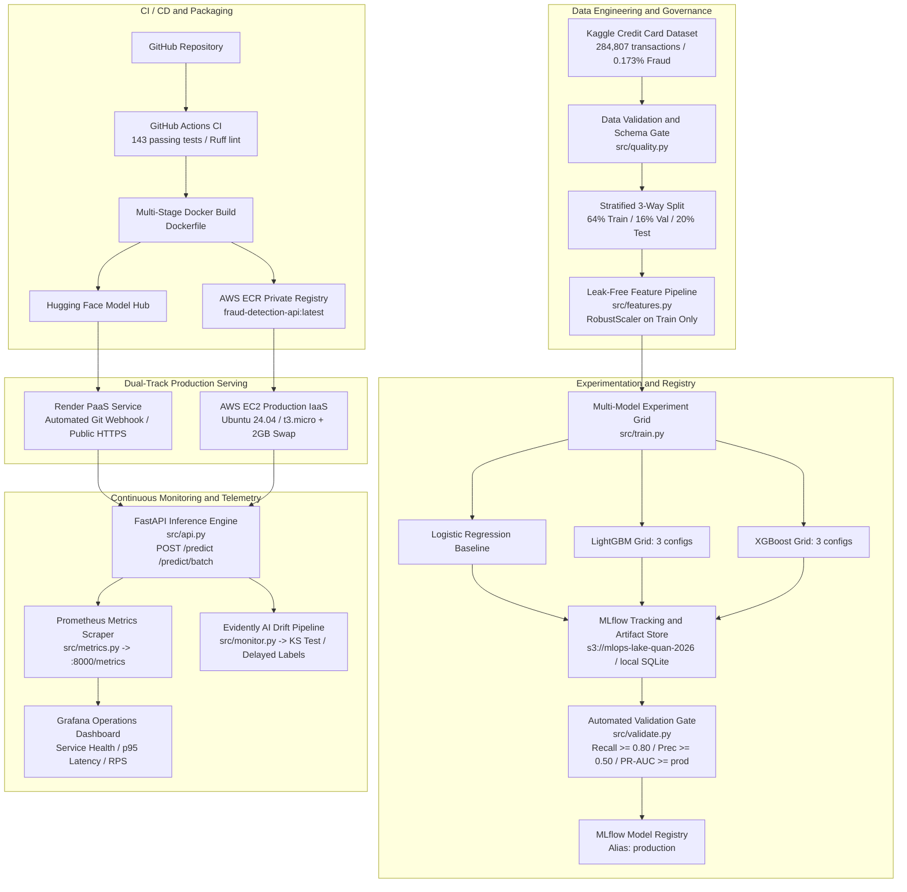

# MLOps Fraud Detection Platform: End-to-End Enterprise Lifecycle

**English** | [Tiếng Việt](README.vi.md)

[](https://github.com/anhquan1111/mlops-fraud-detection/actions/workflows/ci.yml)
[](https://www.python.org/downloads/release/python-3120/)
[](tests/)
[](https://github.com/astral-sh/ruff)
[](https://opensource.org/license/mit)
[](https://mlflow.org/)
[](https://fastapi.tiangolo.com/)
[](https://aws.amazon.com/)
[](https://render.com/)

Production-ready MLOps platform for **real-time credit card fraud detection** on a severely imbalanced financial transaction dataset (~0.173% fraud out of 284,807 transactions).

Engineered with strict anti-leakage data pipelines, automated champion-challenger MLflow model governance, sub-2ms FastAPI inference, a modern enterprise operations dashboard, comprehensive Prometheus/Grafana observability, Evidently AI statistical drift auditing, and production-tested hybrid deployment on both Render (PaaS) and AWS (IaaS: S3, ECR, EC2 with Linux Swap memory optimization).

- **Live Interactive Dashboard:** [https://mlops-fraud-detection-g7c7.onrender.com](https://mlops-fraud-detection-g7c7.onrender.com)
- **Interactive Swagger OpenAPI:** [https://mlops-fraud-detection-g7c7.onrender.com/docs](https://mlops-fraud-detection-g7c7.onrender.com/docs)

---

## Live Interactive Showcase

The platform features an enterprise operations dashboard designed for Fraud Operations (SOC) teams, supporting real-time transaction scoring, explainability risk breakdown, batch stress simulation, and live telemetry health probes.


### Key Dashboard Capabilities

- **Real-Time Fraud Scoring & Risk Gauge:** Instant evaluation with confidence percentage, color-coded threat states (`APPROVED` vs `BLOCKED`), and automated risk tier categorization.
- **Explainable Feature Attribution:** Visual breakdown of top influential factors (including PCA features `V14`, `V12`, `V10`, `V4`, `V17`, and `Amount`) indicating which transaction attributes drove the fraud probability.
- **One-Click Simulation Presets:** Built-in scenario injectors (Verified Legitimate vs High-Risk Fraud) for rapid interactive validation without manual feature entry.
- **Batch Testing Simulator:** High-throughput client simulator sending concurrent requests, computing live approval/block ratios, transaction volume, and per-request latency.
- **Live System Telemetry Probe:** Real-time health check interrogation (`/health`, `/ready`) displaying loaded model provenance, uptime, and engine state.
- **Enterprise Dark/Light Mode:** Full CSS variable-driven responsive theming engine with localized user preference persistence.

---

## Key Performance Benchmarks

All models are trained on the stratified training split (64%, 182,276 rows) and evaluated on the validation split (16%, 45,569 rows, 79 frauds). The held-out test split (20%, 56,962 rows, 98 frauds) is scored strictly once per candidate for reporting and never influences early stopping, hyperparameter tuning, or promotion gating.

| Model / Run | Val PR-AUC | Val Recall | Val Prec | Test PR-AUC | Test Recall | Test Prec | TP | FP | Gate Decision |
|---|---|---|---|---|---|---|---|---|---|
| `lgbm_large` | 0.8160 | 0.7975 | 0.8289 | 0.8703 | 0.8469 | 0.7615 | 83 | 26 | Rejected (Recall < 0.80) |
| `lgbm_default` | 0.8038 | 0.8228 | 0.4815 | 0.8496 | 0.8878 | 0.4652 | 87 | 100 | Rejected (Prec < 0.50) |
| `xgb_default` | 0.7899 | 0.7848 | 0.8267 | 0.8604 | 0.8265 | 0.7714 | 81 | 24 | Rejected (Recall < 0.80) |
| **`lgbm_regularized`** | **0.7407** | **0.8354** | **0.5238** | 0.7462 | 0.8878 | 0.4555 | 87 | 104 | **Passed (Champion)** |
| `xgb_regularized` | 0.7135 | 0.7848 | 0.4593 | 0.7096 | 0.8571 | 0.4200 | 84 | 116 | Rejected (Both criteria) |
| `xgb_deep` | 0.6831 | 0.7342 | 0.5000 | 0.6932 | 0.8061 | 0.4647 | 79 | 91 | Rejected (Recall < 0.80) |
| Logistic Regression (baseline) | 0.6755 | 0.8861 | 0.0591 | 0.7105 | 0.9082 | 0.0606 | 89 | 1379 | Rejected (Prec < 0.50) |

### Champion Model Governance & Selection Integrity

- **Production Champion:** `lgbm_regularized` satisfies all automated promotion criteria and is registered in the MLflow Model Registry under alias `production`.
- **Automated Validation Gate Criteria:**
  - Validation Recall >= 0.80 (captures at least 80% of fraud occurrences)
  - Validation Precision >= 0.50 (at least 50% of flagged alerts are genuine frauds)
  - Validation PR-AUC >= Current Production Model PR-AUC
- **Zero Selection Leakage Principle:** `lgbm_large` achieved higher raw test numbers (test PR-AUC 0.8703, test Recall 0.8469), but was rejected because its validation recall was 0.7975 (63/79 validation frauds, missing the 64/79 floor by exactly 1 transaction). Overriding the gate using test results constitutes selection data leakage; the governance pipeline strictly forbids this.

---

## Decision Threshold Calibration

Operating point calibration is controlled via the `DECISION_THRESHOLD` environment variable at startup. Modifying the operating point requires zero code changes, zero model retraining, and zero container rebuilds.

| Operating Threshold | Test Recall | Test Precision | True Positives | False Positives | False Negatives | Operational Impact |
|---|---|---|---|---|---|---|
| **0.50** (Default) | 0.8878 | 0.4555 | 87 | 104 | 11 | Baseline detection point |
| **0.81** (Recommended) | 0.8673 | **0.7083** | 85 | **35** | 13 | Eliminates 69 false alarms (-66.3%) while catching 85 of 98 frauds |

- **Calibrated Selection:** Threshold 0.81 was selected on the validation split (optimizing precision subject to recall >= 0.80) and verified on the test split exactly once via `uv run python scripts/select_threshold.py`.
- **Business Trade-Off:** Moving from 0.50 to 0.81 reduces analyst manual review workload by 66.3% with only 2 incremental fraud misses across 56,962 test transactions.

---

## End-to-End System Architecture



---

## Enterprise MLOps Pillars

### 1. Data Leakage Prevention

The data pipeline enforces strict isolation to prevent train-test contamination:
- **Three-Way Stratified Split:** Split logic carves out the test set (20%) first, ensuring identical class distribution (~0.173% fraud) across all subsets. Adjusting validation split size never alters test set boundaries.
- **Train-Only Parameter Fitting:** The feature scaler for `Amount` is fitted exclusively on the 64% training split and applied to validation and test splits using stored parameters.
- **Raw Input Ingestion:** Transaction payloads accept raw, unscaled `Amount` values matching real-world client requests. Preprocessing transformations occur inside the isolated service pipeline.

### 2. Multi-Cloud Deployment Architecture

The platform supports two validated production deployment architectures:

#### Track A: Render PaaS (Managed Cloud)
- Automated continuous deployment triggered by GitHub commits via `render.yaml`.
- Secure runtime model pulling from Hugging Face Hub artifact repository (`HF_REPO_ID`).
- Zero-downtime health checking (`/health`) and managed TLS/HTTPS termination.

#### Track B: AWS Enterprise IaaS (Hardened Infrastructure)
- **Amazon S3 (`mlops-lake-quan-2026`):** Centralized cloud artifact storage for serialized model binaries.
- **Amazon ECR (`fraud-detection-api`):** Enterprise container registry hosting multi-stage, rootless Docker images.
- **Amazon EC2 (`t3.micro`):** Production compute host running the complete 3-tier container stack (FastAPI, Prometheus, Grafana).
- **Linux Swap Memory Optimization:** Configured a dedicated 2.0 GiB swapfile (`/swapfile`) on the 20 GiB gp3 EBS root volume. This expands available virtual memory to ~3.0 GiB, permanently eliminating out-of-memory kernel lockups when running Python, Prometheus, and Grafana simultaneously on `t3.micro`.
- **IAM Least-Privilege Role (`fraud-ec2-role`):** EC2 instance profile with read-only access to S3 and ECR, enabling completely credential-less authentication on the host.

### 3. Continuous Observability & Telemetry

Production monitoring operates across three synchronized layers:

#### Operational Telemetry (Prometheus & Grafana)
Prometheus scrapes the `/metrics` endpoint every 15 seconds, collecting request throughput, status codes, p95/p99 latency distributions, and live fraud detection counts.


Grafana automatically provisions the Prometheus datasource and presents a comprehensive operational dashboard tracking service health, prediction traffic, error rates, and in-flight requests.


#### Data & Model Drift Detection (Evidently AI)
Statistical distribution drift is evaluated per feature using Kolmogorov-Smirnov tests and Wasserstein distance comparisons against the baseline training reference.


#### Delayed-Label Ground Truth Audits
Financial fraud labels arrive days or weeks after transaction authorization. The monitoring system implements matured cohort auditing (`src/monitor.py`), joining historical inference records with late-arriving chargeback labels to compute true operational precision and recall once feedback windows mature.

---

## Quick Start

### Prerequisites

- Python 3.12+
- [uv](https://github.com/astral-sh/uv) (recommended package manager) or pip
- Docker & Docker Compose (optional, for containerized stack)

### 1. Clone & Install Dependencies

```bash
git clone https://github.com/anhquan1111/mlops-fraud-detection.git
cd mlops-fraud-detection

# Install project dependencies with uv
uv sync
```

### 2. Download Dataset

Download `creditcard.csv` from [Kaggle Credit Card Fraud Detection](https://www.kaggle.com/datasets/mlg-ulb/creditcardfraud) and place it into `data/raw/creditcard.csv`:

```bash
# Using Kaggle CLI
kaggle datasets download -d mlg-ulb/creditcardfraud -p data/raw/ --unzip
```

### 3. Execute Training Pipeline

```bash
# Run 7-experiment training grid with MLflow tracking
uv run python -m src.train
```

### 4. Evaluate & Promote Best Model

```bash
# Validate against governance criteria and register champion
uv run python scripts/select_best_model.py
```

### 5. Launch FastAPI Service

```bash
# Start API locally with reload
uv run uvicorn src.api:app --host 0.0.0.0 --port 8000 --reload
```

Open dashboard at `http://localhost:8000/` or Swagger docs at `http://localhost:8000/docs`.

---

## Docker & Production Stack

### Run Full Observability Stack Locally

Launch FastAPI, Prometheus, and Grafana with one command:

```bash
# Create local environment config
if (-not (Test-Path .env)) { Copy-Item .env.example .env }

# Build and start all 3 containers in background
docker compose up -d --build
docker compose ps
```

| Service | Host Endpoint | Description |
|---|---|---|
| **FastAPI Dashboard & Docs** | `http://localhost:8000/docs` | Interactive API and operations dashboard |
| **Prometheus Targets** | `http://localhost:9090/targets` | Metric collection engine and target status |
| **Grafana Dashboard** | `http://localhost:3000` | Real-time monitoring panels (user: `admin` / `fraud-local-only`) |

Health & diagnostic checks:

```powershell
curl.exe http://127.0.0.1:8000/ready
curl.exe http://127.0.0.1:8000/metrics
docker compose logs --tail=50 api prometheus grafana
```

---

## API Specification

### `POST /predict`
Evaluates a single credit card transaction.

**Request:**
```json
{
  "Time": 406.0,
  "V1": -2.31,
  "V2": 1.95,
  "V3": -1.60,
  "V4": 3.99,
  "V5": -0.52,
  "V6": -1.42,
  "V7": -2.53,
  "V8": 1.39,
  "V9": -2.77,
  "V10": -2.77,
  "V11": 3.20,
  "V12": -2.89,
  "V13": -0.59,
  "V14": -4.28,
  "V15": 0.38,
  "V16": -1.14,
  "V17": -2.83,
  "V18": -0.01,
  "V19": 0.41,
  "V20": 0.12,
  "V21": 0.51,
  "V22": -0.03,
  "V23": -0.46,
  "V24": 0.32,
  "V25": 0.04,
  "V26": 0.17,
  "V27": 0.26,
  "V28": -0.14,
  "Amount": 239.93
}
```

**Response (`HTTP 200 OK`):**
```json
{
  "is_fraud": true,
  "fraud_probability": 0.9412,
  "decision_threshold": 0.5,
  "model_version": "1.0.0"
}
```

### `POST /predict/batch`
High-throughput endpoint accepting an array of transaction objects.

### `GET /health`
Liveness probe returning service status, model metadata, source location, and memory health.

### `GET /ready`
Readiness probe verifying that model weights are loaded and active.

### `GET /metrics`
Standard Prometheus exposition metrics endpoint.

### `GET /reports/latest`
Serves the latest rendered Evidently HTML data drift report.

---

## Latency & Performance Benchmarks

### In-Process Inference Latency
Measured over 300 iterations after warm-up (includes validation, preprocessing, and model scoring; excludes external network transit):

| Request Type | Median Latency | p95 Latency | Per-Transaction Cost |
|---|---|---|---|
| Single Transaction (`POST /predict`) | **1.58 ms** | 2.45 ms | 1.58 ms |
| Batch 10 Transactions (`POST /predict/batch`) | 2.33 ms | 3.88 ms | 0.233 ms |
| Batch 100 Transactions (`POST /predict/batch`) | **5.99 ms** | 7.94 ms | **0.060 ms** |

*Note: Batching achieves an ~26x throughput improvement per transaction because vectorization runs across the entire batch frame simultaneously.*

### Container Startup Performance
Measured against Hugging Face Hub remote artifact repository:

| Startup Scenario | Download Duration | `joblib.load` Duration | Total Initialization |
|---|---|---|---|
| Cold Start (Fresh container, empty cache) | ~3.5 s | ~1.3 s | **~4.8 s** |
| Warm Start (Cached artifact) | ~0.1 s | ~5 ms | **~0.15 s** |

---

## Testing & Quality Assurance

The codebase enforces strict test-driven standards with 143 automated test cases passing in under 12 seconds:

```bash
# Execute entire test suite
uv run pytest tests/ -v

# Static analysis and linting
uv run ruff check src/ tests/ scripts/

# Format verification
uv run ruff format --check src/ tests/ scripts/
```

### Test Suite Architecture

| Test Module | Coverage Scope |
|---|---|
| `tests/test_features.py` | 3-way split integrity, train-only scaler verification, non-overlapping index enforcement |
| `tests/test_api.py` | Pydantic schema validation, NaN/Inf rejection, response format, health probes |
| `tests/test_config.py` | Environment variable overrides, threshold boundary checks |
| `tests/test_evaluate.py` | PR-AUC, ROC-AUC, Precision, Recall, and F1 calculations on edge cases |
| `tests/test_validate.py` | Champion-challenger validation gating logic and promotion rules |
| `tests/test_quality.py` | Raw transaction range checking, schema validation, and missing feature detection |
| `tests/test_review_regressions.py` | Regression guards preventing recurrence of historical data leakage issues |
| `tests/test_monitor.py` & `test_monitor_cli.py` | Feature drift detection, statistical baseline comparison, delayed-label cohorts |
| `tests/test_metrics.py` | Prometheus custom collectors, request counters, and histogram buckets |
| `tests/test_storage.py` | S3 remote storage abstractions and mocked cloud artifact transfers |

---

## Repository Structure

```text
mlops-fraud-detection/
|-- compose.yaml                 # Local Docker Compose stack (FastAPI + Prometheus + Grafana)
|-- Dockerfile                   # Multi-stage production container image
|-- render.yaml                  # Render PaaS deployment blueprint
|-- pyproject.toml               # Project metadata and dependencies
|-- .github/
|   `-- workflows/
|       `-- ci.yml               # GitHub Actions CI workflow (lint + test)
|-- src/                         # Core platform source code
|   |-- api.py                   # FastAPI application, routes, and dashboard serving
|   |-- config.py                # Central configuration and environment settings
|   |-- evaluate.py              # Metric calculation routines (PR-AUC, F1, Recall)
|   |-- features.py              # Data ingestion, 3-way splitting, and feature transforms
|   |-- metrics.py               # Prometheus metrics collectors and middleware
|   |-- monitor.py               # Evidently drift auditing and delayed-label evaluation
|   |-- quality.py               # Raw input schema verification and quality gates
|   |-- storage.py               # AWS S3 cloud storage utility module
|   |-- train.py                 # Multi-model training pipeline with MLflow tracking
|   |-- validate.py              # Automated validation gate and model registry promotion
|   `-- templates/
|       `-- dashboard.html       # Enterprise operational dashboard UI
|-- monitoring/                  # Observability configuration
|   |-- alerts.yml               # Prometheus alert evaluation rules
|   |-- prometheus.yml           # Scrape configuration for API container
|   `-- grafana/                 # Provisioned Grafana datasources and dashboards
|-- scripts/                     # Operational automation scripts
|   |-- benchmark_latency.py     # In-process endpoint latency benchmark
|   |-- benchmark_model_load.py  # Model load cold/warm start benchmark
|   |-- export_model.py          # Export MLflow registered model to standalone pickle
|   |-- monitor_local.py         # Generate local Evidently drift reports
|   |-- select_best_model.py     # Select champion model and promote to production
|   `-- select_threshold.py      # Threshold tuning and verification script
|-- tests/                       # 143 automated test cases
|-- docs/                        # In-depth architectural documentation
|   |-- architecture.md          # System architecture and design choices
|   |-- leakage_fix.md           # Data leakage analysis, diagnosis, and fix
|   |-- model_card.md            # Production Model Card and ethical considerations
|   |-- review_day4.md           # Code review walkthrough and operational guide
|   `-- figures/                 # Architecture figures and dashboard demo GIF
`-- README.md                    # Platform documentation
```

---

## Engineering Design Decisions

| Strategic Decision | Technical Rationale |
|---|---|
| **PR-AUC as Primary Metric** | On datasets with 0.173% positive class, ROC-AUC yields deceptively high scores (>0.95) driven by huge true negative counts. PR-AUC focuses strictly on the rare fraud minority. |
| **`class_weight='balanced'`** | Adjusts cost function penalties without generating synthetic data or distorting feature distributions, avoiding the high risk of cross-validation leakage common to SMOTE. |
| **Stratified 64/16/20 Split** | Carving the test set out first guarantees that test transactions remain completely unseen during early stopping, hyperparameter search, and promotion gating. |
| **Validation-Only Selection** | The test set is evaluated exactly once per candidate for reporting. All early stopping and model selection occurs on the validation split. |
| **Decoupled Telemetry vs Drift** | Real-time service latency (Prometheus) requires sub-second resolution, whereas feature drift (Evidently) requires batched statistical windows. Decoupling ensures zero performance penalty on production inference. |
| **Linux Swap Memory on EC2** | AWS Free-Tier `t3.micro` (1 GB RAM) experiences out-of-memory lockups when hosting ML inference alongside Prometheus and Grafana. A 2.0 GiB swapfile provides a reliable safety buffer at zero financial cost. |

---

## Documentation & References

- [Data Leakage Analysis & Solution](docs/leakage_fix.md): In-depth retrospective on data leakage vulnerabilities, regression fixes, and impact analysis.
- [Production Model Card](docs/model_card.md): Detailed model performance specifications, threshold curves, limitations, and operational guidance.
- [Architecture Design Document](docs/architecture.md): Deep-dive into architectural trade-offs, metric selection, and system topology.
- [Walkthrough & Verification Guide](docs/review_day4.md): Step-by-step verification commands, operational test evidence, and regression findings.

---

## License

This project is licensed under the MIT License - see the [LICENSE](LICENSE) file for details.
