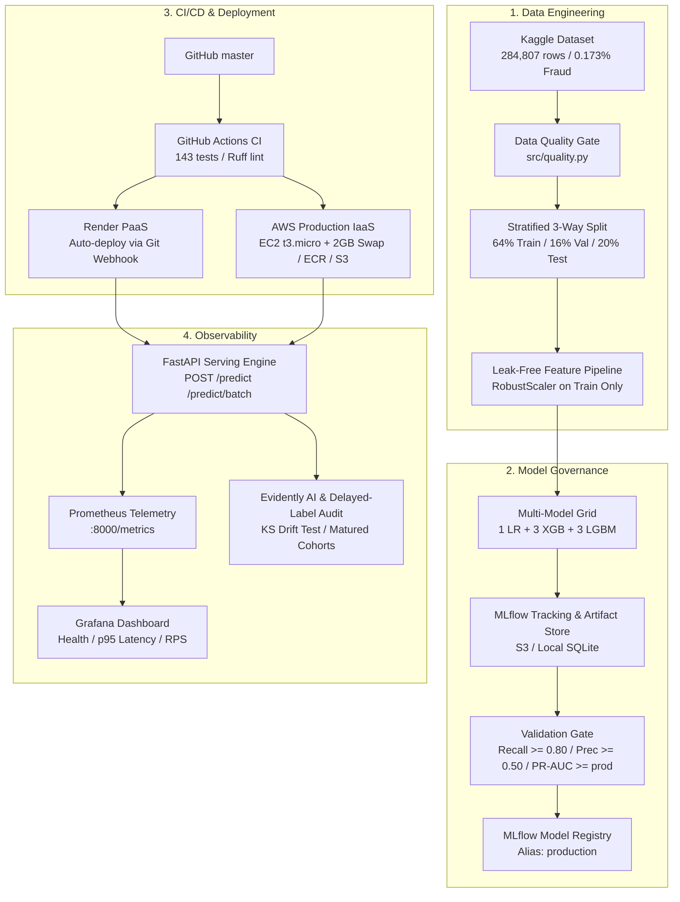
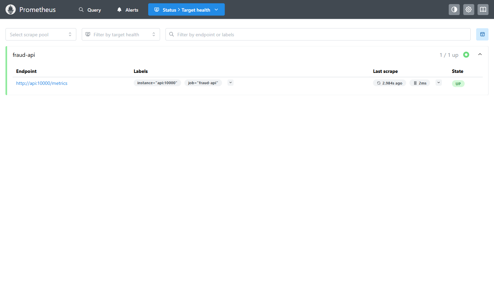
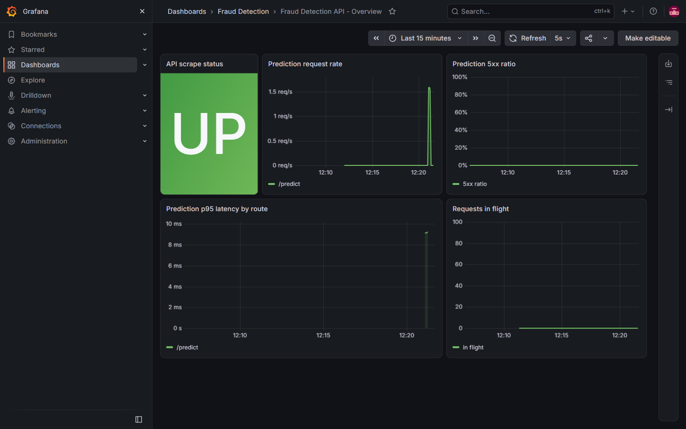
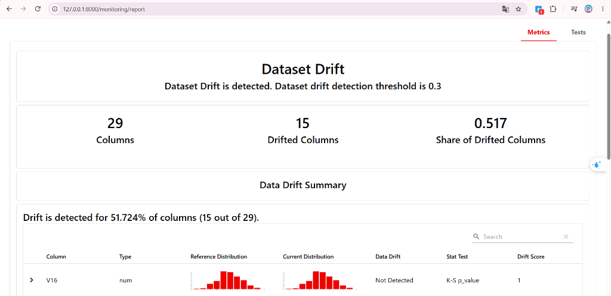

# MLOps Fraud Detection Platform: End-to-End Enterprise Lifecycle

**English** | [Tiếng Việt](README.vi.md)

[](https://github.com/anhquan1111/mlops-fraud-detection/actions/workflows/ci.yml)
[](https://www.python.org/downloads/release/python-3120/)
[](tests/)
[](https://github.com/astral-sh/ruff)
[](https://opensource.org/license/mit)
[](https://mlflow.org/)
[](https://fastapi.tiangolo.com/)
[](https://aws.amazon.com/)
[](https://render.com/)

Production-ready MLOps platform for **real-time credit card fraud detection** on severely imbalanced financial transactions (~0.173% fraud out of 284,807 transactions).

Engineered with leak-free feature pipelines, automated MLflow champion-challenger model governance, sub-2ms FastAPI inference, an enterprise operations dashboard, full Prometheus/Grafana observability, Evidently AI drift auditing, and hybrid cloud deployment (Render PaaS + AWS IaaS with Linux Swap memory optimization).

- **Live Operations Dashboard:** [https://fraud-detection-api-068f.onrender.com](https://fraud-detection-api-068f.onrender.com)
- **Interactive Swagger OpenAPI:** [https://fraud-detection-api-068f.onrender.com/docs](https://fraud-detection-api-068f.onrender.com/docs)

---

## Live Operations Showcase

The platform includes a real-time operations dashboard tailored for Fraud Operations (SOC) analysts:


- **Real-Time Fraud Scoring & Risk Gauge:** Instant probability estimation with automated decision states (`APPROVED` vs `BLOCKED`).
- **Feature Attribution Breakdown:** Visualizes impact of dominant PCA features (`V14`, `V12`, `V10`, `V4`, `V17`) and `Amount`.
- **Interactive Simulation Presets:** Instant loading of verified legitimate and high-risk fraud scenarios.
- **Batch Testing Simulator:** High-throughput client simulation tracking approval rates and average per-request latency.
- **Live Health Probe & Telemetry:** Dynamic inspection of loaded model metadata, engine state, and uptime.
- **Modern Theme Engine:** Responsive Light and Dark mode with client preference persistence.

---

## System Architecture



---

## Key Performance Benchmarks

Models are trained on the stratified training set (64%, 182,276 rows) and evaluated on validation (16%, 45,569 rows, 79 frauds). The held-out test split (20%, 56,962 rows, 98 frauds) is scored strictly once per candidate for reporting.

| Model / Run | Val PR-AUC | Val Recall | Val Prec | Test PR-AUC | Test Recall | Test Prec | Gate Decision |
|---|---|---|---|---|---|---|---|
| **`lgbm_regularized`** | **0.7407** | **0.8354** | **0.5238** | 0.7462 | 0.8878 | 0.4555 | **Passed (Champion)** |
| `lgbm_large` | 0.8160 | 0.7975 | 0.8289 | 0.8703 | 0.8469 | 0.7615 | Rejected (Recall < 0.80) |
| `lgbm_default` | 0.8038 | 0.8228 | 0.4815 | 0.8496 | 0.8878 | 0.4652 | Rejected (Prec < 0.50) |
| `xgb_default` | 0.7899 | 0.7848 | 0.8267 | 0.8604 | 0.8265 | 0.7714 | Rejected (Recall < 0.80) |
| Logistic Regression (baseline) | 0.6755 | 0.8861 | 0.0591 | 0.7105 | 0.9082 | 0.0606 | Rejected (Prec < 0.50) |

<details>
<summary><b>View Full 7-Model Evaluation Grid and Selection Leakage Analysis</b></summary>

| Model | Val PR-AUC | Val Recall | Val Prec | Test PR-AUC | Test Recall | Test Prec | TP | FP | Rejection Reason |
|---|---|---|---|---|---|---|---|---|---|
| `lgbm_large` | 0.8160 | 0.7975 | 0.8289 | 0.8703 | 0.8469 | 0.7615 | 83 | 26 | Validation Recall 0.7975 (63/79 frauds, missed 64/79 floor by 1) |
| `lgbm_default` | 0.8038 | 0.8228 | 0.4815 | 0.8496 | 0.8878 | 0.4652 | 87 | 100 | Validation Precision 0.4815 (< 0.50 floor) |
| `xgb_default` | 0.7899 | 0.7848 | 0.8267 | 0.8604 | 0.8265 | 0.7714 | 81 | 24 | Validation Recall 0.7848 (< 0.80 floor) |
| **`lgbm_regularized`** | **0.7407** | **0.8354** | **0.5238** | 0.7462 | 0.8878 | 0.4555 | 87 | 104 | Promoted to production |
| `xgb_regularized` | 0.7135 | 0.7848 | 0.4593 | 0.7096 | 0.8571 | 0.4200 | 84 | 116 | Rejected on both Recall and Precision |
| `xgb_deep` | 0.6831 | 0.7342 | 0.5000 | 0.6932 | 0.8061 | 0.4647 | 79 | 91 | Validation Recall 0.7342 (< 0.80 floor) |
| Logistic Regression | 0.6755 | 0.8861 | 0.0591 | 0.7105 | 0.9082 | 0.0606 | 89 | 1379 | Baseline reference point (flags ~1,400 FP) |

**Zero Selection Leakage Principle:** While `lgbm_large` scored higher on the test set, it failed validation recall (0.7975 vs 0.8000). Overriding the gate using test numbers is a selection data leak; the automated gate strictly rejects it.
</details>

---

## Decision Threshold Tuning

Threshold is configured via the `DECISION_THRESHOLD` environment variable at container startup without code changes or retraining:

| Threshold | Test Recall | Test Precision | False Positives | Operational Impact |
|---|---|---|---|---|
| **0.50** (Default) | 0.8878 | 0.4555 | 104 | Standard baseline detection point |
| **0.81** (Recommended) | 0.8673 | **0.7083** | **35** | **-66.3% false alarms**, catches 85 of 98 test frauds |

Calibrated on the validation split and verified once on test via `uv run python scripts/select_threshold.py`.

---

## Deployment Strategy: Hybrid Architecture & Cloud Governance

To balance interactive public accessibility with enterprise infrastructure design, the platform follows a dual-track deployment strategy:

### 1. Render PaaS (Live Public Showcase)
- Serves as the **always-on public demo environment** ([https://fraud-detection-api-068f.onrender.com](https://fraud-detection-api-068f.onrender.com)) for instant evaluation by recruiters and reviewers without server management costs.
- Fully automated CI/CD triggered via GitHub webhook (`render.yaml`), pulling serialized model weights from Hugging Face Hub (`HF_REPO_ID`).
- Zero-downtime rolling deploys with automated health check probes (`/health`).

### 2. AWS Enterprise IaaS (Production Blueprint & Cloud PoC)
- Serves as the **hardened enterprise blueprint**, verified and benchmarked in production:
  - **Amazon S3 (`mlops-lake-quan-2026`):** Centralized cloud storage for model registry artifacts.
  - **Amazon ECR (`fraud-detection-api`):** Secure private container registry hosting multi-stage, rootless Docker images.
  - **Amazon EC2 (`t3.micro`):** Dedicated production host running the complete 3-container stack (FastAPI, Prometheus, Grafana).
  - **Linux Swap Memory Optimization:** Configured a 2.0 GiB swapfile (`/swapfile`) on the 20 GiB gp3 EBS volume. This expands virtual memory to ~3.0 GiB, permanently eliminating kernel out-of-memory lockups on Free-Tier `t3.micro`.
  - **IAM Least-Privilege Role:** EC2 Instance Profile grants passwordless, credential-free read access to S3 and ECR.
  - **FinOps & Cost Governance:** Following enterprise FinOps practices, the AWS infrastructure was verified end-to-end and documented as a reproducible deployment blueprint rather than incurring idle cloud costs.

---

## Continuous Observability

Production monitoring operates across three synchronized layers:

| Layer | Technology | Key Metrics / Signals | Reference Preview |
|---|---|---|---|
| **Service Telemetry** | Prometheus | Scrapes `/metrics` every 15s; tracks throughput, error rate, p95 latency |  |
| **Operations Dashboard** | Grafana | 5-panel dashboard: Service Health, Traffic, Latency distributions, In-flight requests |  |
| **Data & Model Drift** | Evidently AI | Kolmogorov-Smirnov distribution checks, Wasserstein distance, delayed-label audits |  |

---

## Quick Start

### 1. Setup Environment

```bash
git clone https://github.com/anhquan1111/mlops-fraud-detection.git
cd mlops-fraud-detection
uv sync
```

### 2. Train & Promote Best Model

```bash
# Download Kaggle dataset to data/raw/creditcard.csv, then run:
uv run python -m src.train
uv run python scripts/select_best_model.py
```

### 3. Launch Local Service or Full Stack

```bash
# Option A: Standalone FastAPI API + Dashboard
uv run uvicorn src.api:app --host 0.0.0.0 --port 8000 --reload

# Option B: Complete Local Stack (FastAPI + Prometheus + Grafana)
docker compose up -d --build
```

Access API & Dashboard: `http://localhost:8000` | Grafana: `http://localhost:3000` (`admin` / `fraud-local-only`).

---

## API & Latency Benchmarks

### Core Endpoints

- `POST /predict`: Single transaction evaluation (median **1.58 ms**, p95 **2.45 ms**).
- `POST /predict/batch`: High-throughput batch scoring (100 tx in **5.99 ms** -> **0.060 ms/tx**).
- `GET /health` & `GET /ready`: Service liveness, loaded model provenance, and readiness probes.
- `GET /metrics`: Standard Prometheus metrics exposition.
- `GET /reports/latest`: Latest Evidently HTML drift report.

<details>
<summary><b>View Sample Request and Response JSON</b></summary>

**Request (`POST /predict`):**
```json
{
  "Time": 406.0,
  "V1": -2.31, "V2": 1.95, "V3": -1.60, "V4": 3.99, "V5": -0.52,
  "V6": -1.42, "V7": -2.53, "V8": 1.39, "V9": -2.77, "V10": -2.77,
  "V11": 3.20, "V12": -2.89, "V13": -0.59, "V14": -4.28, "V15": 0.38,
  "V16": -1.14, "V17": -2.83, "V18": -0.01, "V19": 0.41, "V20": 0.12,
  "V21": 0.51, "V22": -0.03, "V23": -0.46, "V24": 0.32, "V25": 0.04,
  "V26": 0.17, "V27": 0.26, "V28": -0.14,
  "Amount": 239.93
}
```

**Response (`HTTP 200 OK`):**
```json
{
  "is_fraud": true,
  "fraud_probability": 0.9412,
  "decision_threshold": 0.5,
  "model_version": "1.0.0"
}
```
</details>

---

## Testing & Quality Assurance

143 automated test cases pass in under 12 seconds with full static analysis compliance:

```bash
uv run pytest tests/ -v
uv run ruff check src/ tests/ scripts/
```

- **Features & Data Pipeline (`tests/test_features.py`):** Enforces 3-way split isolation and train-only scaler fitting.
- **API & Governance (`tests/test_api.py`, `tests/test_validate.py`):** Validates Pydantic schemas, promotion gates, and health probes.
- **Monitoring & Metrics (`tests/test_monitor.py`, `tests/test_metrics.py`):** Tests drift calculations, delayed cohorts, and Prometheus collectors.
- **Leakage Regressions (`tests/test_review_regressions.py`):** Guarantees historical data leakage defects cannot recur.

---

## Documentation Links

- [Data Leakage Analysis & Solution](docs/leakage_fix.md): Retrospective on data leakage vulnerabilities and regression fixes.
- [Production Model Card](docs/model_card.md): Performance specifications, threshold trade-offs, and ethical limitations.
- [System Architecture Design](docs/architecture.md): Metric selection rationale, imbalance strategies, and topology.
- [Walkthrough & Verification Runbook](docs/review_day4.md): Step-by-step verification commands and test logs.

---

## License

MIT License - see [MIT License](https://opensource.org/license/mit) for details.
