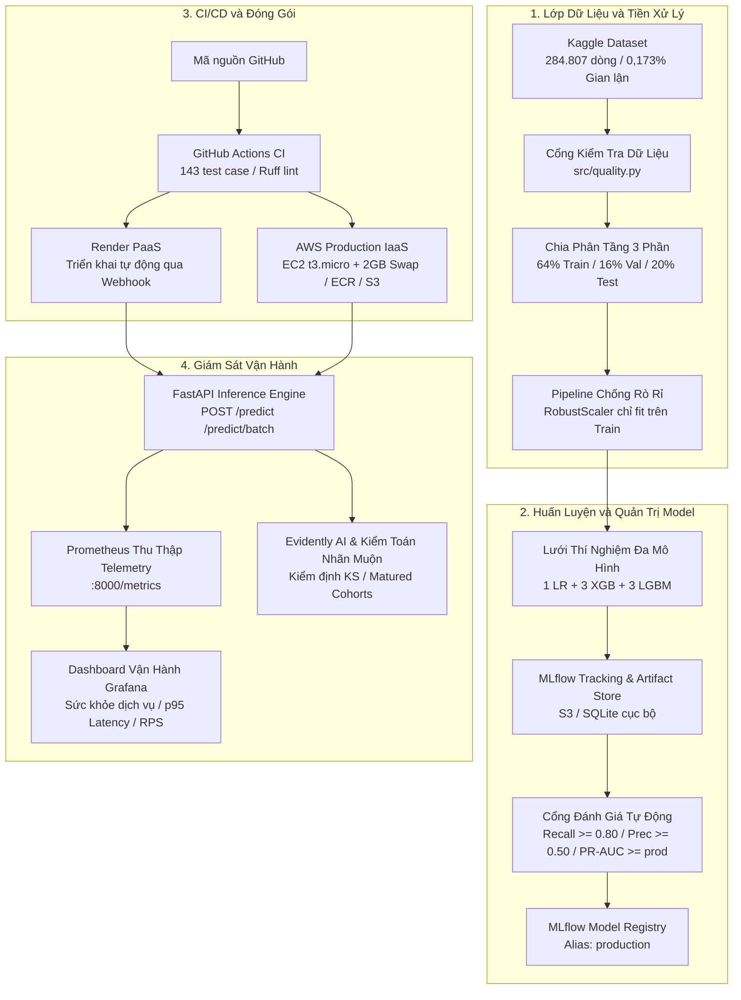

# Hệ Thống MLOps Phát Hiện Gian Lận Thẻ Tín Dụng

[English](README.md) | **Tiếng Việt**

[](https://github.com/anhquan1111/mlops-fraud-detection/actions/workflows/ci.yml)
[](https://www.python.org/downloads/release/python-3120/)
[](tests/)
[](https://github.com/astral-sh/ruff)
[](https://opensource.org/license/mit)
[](https://mlflow.org/)
[](https://fastapi.tiangolo.com/)
[](https://aws.amazon.com/)
[](https://render.com/)

Nền tảng MLOps hoàn chỉnh chuẩn doanh nghiệp cho bài toán **phát hiện gian lận thẻ tín dụng thời gian thực** trên tập dữ liệu mất cân bằng nghiêm trọng (~0,173% gian lận trên tổng số 284.807 giao dịch).

Hệ thống được thiết kế chặt chẽ chống rò rỉ dữ liệu (data leakage), quản trị mô hình tự động champion-challenger qua MLflow, phục vụ suy luận với FastAPI (độ trễ dưới 2ms), dashboard vận hành chuyên nghiệp (Dark/Light theme), giám sát toàn diện Prometheus/Grafana, kiểm toán độ trôi dữ liệu với Evidently AI và hỗ trợ triển khai thực tế đa đám mây (Render PaaS + AWS IaaS với S3, ECR và EC2 tối ưu bộ nhớ Swap).

- **Giao diện Dashboard trực tiếp:** [https://mlops-fraud-detection-g7c7.onrender.com](https://mlops-fraud-detection-g7c7.onrender.com)
- **Tài liệu API Swagger OpenAPI:** [https://mlops-fraud-detection-g7c7.onrender.com/docs](https://mlops-fraud-detection-g7c7.onrender.com/docs)

---

## Giao Diện Vận Hành Trực Quan

Hệ thống tích hợp dashboard quản trị chuyên dụng cho đội ngũ vận hành phòng chống gian lận (Fraud SOC):


- **Chấm Điểm Gian Lận & Đo Rủi Ro:** Phân tích xác suất tức thì với đồng hồ trực quan và tự động gán nhãn (`APPROVED` hoặc `BLOCKED`).
- **Phân Tích Đóng Góp Thuộc Tính (Explainability):** Bóc tách mức độ ảnh hưởng của các đặc trưng quan trọng (`V14`, `V12`, `V10`, `V4`, `V17` và `Amount`).
- **Mẫu Giả Lập Tức Thì:** Tải nhanh mẫu giao dịch chuẩn (Hợp lệ vs Gian lận nguy cơ cao) để kiểm thử mà không cần nhập tay 30 trường.
- **Trình Giả Lập Kiểm Thử Hàng Loạt (Batch Simulator):** Mô phỏng luồng giao dịch đồng thời, thống kê tức thời tỷ lệ chặn và độ trễ phản hồi.
- **Kiểm Tra Trạng Thái Sức Khỏe Máy Chủ (Health Probe):** Truy vấn trực tiếp `/health` và `/ready`, hiển thị chi tiết nguồn model và trạng thái vận hành.
- **Giao Diện Sáng / Tối (Dark / Light Mode):** Tùy biến linh hoạt qua CSS Variables, tự động lưu tùy chọn của người dùng.

---

## Kiến Trúc Hệ Thống Tổng Thể



---

## Bảng Kết Quả Huấn Luyện & Tuyển Chọn Model

Tất cả mô hình được huấn luyện trên tập train phân tầng (64%, 182.276 dòng) và đánh giá trên tập validation (16%, 45.569 dòng, 79 ca gian lận). Tập test độc lập (20%, 56.962 dòng, 98 ca gian lận) chỉ được chấm điểm một lần duy nhất để báo cáo.

| Mô hình / Cấu hình | Val PR-AUC | Val Recall | Val Prec | Test PR-AUC | Test Recall | Test Prec | Kết quả Cổng duyệt |
|---|---|---|---|---|---|---|---|
| **`lgbm_regularized`** | **0.7407** | **0.8354** | **0.5238** | 0.7462 | 0.8878 | 0.4555 | **Đạt chuẩn (Champion)** |
| `lgbm_large` | 0.8160 | 0.7975 | 0.8289 | 0.8703 | 0.8469 | 0.7615 | Từ chối (Recall < 0.80) |
| `lgbm_default` | 0.8038 | 0.8228 | 0.4815 | 0.8496 | 0.8878 | 0.4652 | Từ chối (Prec < 0.50) |
| `xgb_default` | 0.7899 | 0.7848 | 0.8267 | 0.8604 | 0.8265 | 0.7714 | Từ chối (Recall < 0.80) |
| Logistic Regression (baseline) | 0.6755 | 0.8861 | 0.0591 | 0.7105 | 0.9082 | 0.0606 | Từ chối (Prec < 0.50) |

<details>
<summary><b>Xem Chi Tiết Lưới 7 Thí Nghiệm & Phân Tích Chống Rò Rỉ Tuyển Chọn</b></summary>

| Mô hình | Val PR-AUC | Val Recall | Val Prec | Test PR-AUC | Test Recall | Test Prec | TP | FP | Lý do từ chối |
|---|---|---|---|---|---|---|---|---|---|
| `lgbm_large` | 0.8160 | 0.7975 | 0.8289 | 0.8703 | 0.8469 | 0.7615 | 83 | 26 | Val Recall 0.7975 (63/79 ca, thiếu đúng 1 ca so với sàn 64/79) |
| `lgbm_default` | 0.8038 | 0.8228 | 0.4815 | 0.8496 | 0.8878 | 0.4652 | 87 | 100 | Val Precision 0.4815 (< mốc sàn 0.50) |
| `xgb_default` | 0.7899 | 0.7848 | 0.8267 | 0.8604 | 0.8265 | 0.7714 | 81 | 24 | Val Recall 0.7848 (< mốc sàn 0.80) |
| **`lgbm_regularized`** | **0.7407** | **0.8354** | **0.5238** | 0.7462 | 0.8878 | 0.4555 | 87 | 104 | Thăng cấp lên production |
| `xgb_regularized` | 0.7135 | 0.7848 | 0.4593 | 0.7096 | 0.8571 | 0.4200 | 84 | 116 | Bị loại ở cả 2 tiêu chí Recall và Precision |
| `xgb_deep` | 0.6831 | 0.7342 | 0.5000 | 0.6932 | 0.8061 | 0.4647 | 79 | 91 | Val Recall 0.7342 (< mốc sàn 0.80) |
| Logistic Regression | 0.6755 | 0.8861 | 0.0591 | 0.7105 | 0.9082 | 0.0606 | 89 | 1379 | Chuẩn đối chiếu (báo động giả ~1.400 ca) |

**Nguyên Tắc Chống Selection Leakage:** Dù `lgbm_large` đạt điểm trên test set cao nhất, mô hình vẫn bị loại do Validation Recall chỉ đạt 0.7975. Can thiệp đè lên cổng duyệt bằng kết quả test set là rò rỉ dữ liệu tuyển chọn; quy trình tự động nghiêm cấm hành vi này.
</details>

---

## Hiệu Chuẩn Ngưỡng Quyết Định (Decision Threshold)

Ngưỡng vận hành được cấu hình thông qua biến môi trường `DECISION_THRESHOLD` khi khởi động container mà không cần sửa code hay train lại model:

| Ngưỡng vận hành | Test Recall | Test Precision | Số ca báo động giả | Ý nghĩa thực tế |
|---|---|---|---|---|
| **0.50** (Mặc định) | 0.8878 | 0.4555 | 104 | Điểm vận hành tiêu chuẩn ban đầu |
| **0.81** (Đề xuất) | 0.8673 | **0.7083** | **35** | **Giảm 66,3% báo động giả**, bắt 85/98 ca gian lận test |

Ngưỡng 0.81 được tối ưu trên tập validation và kiểm chứng duy nhất một lần trên test qua lệnh `uv run python scripts/select_threshold.py`.

---

## Kiến Trúc Triển Khai Đa Đám Mây (Hybrid Deployment)

### 1. Render PaaS (Quản lý tự động)
- Triển khai tự động kích hoạt qua Git webhook từ nhánh `master` thông qua `render.yaml`.
- Tự động nạp trọng số mô hình từ kho lưu trữ Hugging Face Hub (`HF_REPO_ID`).
- Cập nhật rolling update không gián đoạn dịch vụ với cơ chế kiểm tra `/health`.

### 2. AWS Enterprise IaaS (Hạ tầng điện toán đám mây riêng)
- **Amazon S3 (`mlops-lake-quan-2026`):** Lưu trữ tập trung các artifact mô hình độc lập.
- **Amazon ECR (`fraud-detection-api`):** Kho chứa container bảo mật cho Docker image multi-stage non-root.
- **Amazon EC2 (`t3.micro`):** Máy chủ đám mây chạy toàn bộ cụm 3 container (FastAPI, Prometheus, Grafana).
- **Tối Ưu Bộ Nhớ Swap Trên Linux:** Cấu hình 2.0 GiB swapfile (`/swapfile`) trên ổ EBS gp3, nâng bộ nhớ ảo lên ~3.0 GiB, khắc phục triệt để lỗi tràn RAM (OOM) trên gói Free-Tier `t3.micro`.
- **Phân Quyền IAM Instance Profile:** Máy chủ EC2 tự động xác thực đọc S3 và ECR mà không cần lưu trữ bất kỳ access key nào.

---

## Hệ Thống Giám Sát Toàn Diện (Observability)

Giám sát sản xuất vận hành trên 3 tầng đồng bộ:

| Tầng giám sát | Công nghệ | Chỉ số & Tín hiệu chính | Hình ảnh minh họa |
|---|---|---|---|
| **Telemetry Dịch Vụ** | Prometheus | Cào `/metrics` mỗi 15s; đo throughput, tỷ lệ lỗi 5xx, p95 latency |  |
| **Dashboard Vận Hành** | Grafana | 5 bảng điều khiển: Sức khỏe dịch vụ, Lưu lượng, Phân phối độ trễ, Request đồng thời |  |
| **Độ Trôi & Nhãn Muộn** | Evidently AI | Kiểm định Kolmogorov-Smirnov, khoảng cách Wasserstein, kiểm toán nhóm nhãn đến muộn |  |

---

## Hướng Dẫn Chạy Nhanh

### 1. Cài Đặt Môi Trường

```bash
git clone https://github.com/anhquan1111/mlops-fraud-detection.git
cd mlops-fraud-detection
uv sync
```

### 2. Huấn Luyện & Thăng Cấp Mô Hình

```bash
# Tải dataset Kaggle vào data/raw/creditcard.csv, sau đó chạy:
uv run python -m src.train
uv run python scripts/select_best_model.py
```

### 3. Khởi Chạy Dịch Vụ Cục Bộ Hoặc Toàn Bộ Cụm Container

```bash
# Lựa chọn A: Chạy riêng API FastAPI + Dashboard
uv run uvicorn src.api:app --host 0.0.0.0 --port 8000 --reload

# Lựa chọn B: Khởi chạy toàn bộ cụm Docker (FastAPI + Prometheus + Grafana)
docker compose up -d --build
```

Truy cập API & Dashboard: `http://localhost:8000` | Grafana: `http://localhost:3000` (`admin` / `fraud-local-only`).

---

## Điểm Chuẩn Độ Trễ & Đặc Tả API

### Các Endpoint Chính

- `POST /predict`: Đánh giá 1 giao dịch đơn lẻ (median **1.58 ms**, p95 **2.45 ms**).
- `POST /predict/batch`: Chấm điểm lô lớn hiệu năng cao (100 giao dịch trong **5.99 ms** -> **0.060 ms/giao dịch**).
- `GET /health` & `GET /ready`: Kiểm tra độ sẵn sàng và nguồn gốc trọng số mô hình đang phục vụ.
- `GET /metrics`: Định dạng số liệu chuẩn cho Prometheus thu thập.
- `GET /reports/latest`: Báo cáo độ trôi dữ liệu HTML mới nhất của Evidently AI.

<details>
<summary><b>Xem Ví Dụ Dữ Liệu Gửi Lên Và Phản Hồi JSON</b></summary>

**Dữ liệu gửi lên (`POST /predict`):**
```json
{
  "Time": 406.0,
  "V1": -2.31, "V2": 1.95, "V3": -1.60, "V4": 3.99, "V5": -0.52,
  "V6": -1.42, "V7": -2.53, "V8": 1.39, "V9": -2.77, "V10": -2.77,
  "V11": 3.20, "V12": -2.89, "V13": -0.59, "V14": -4.28, "V15": 0.38,
  "V16": -1.14, "V17": -2.83, "V18": -0.01, "V19": 0.41, "V20": 0.12,
  "V21": 0.51, "V22": -0.03, "V23": -0.46, "V24": 0.32, "V25": 0.04,
  "V26": 0.17, "V27": 0.26, "V28": -0.14,
  "Amount": 239.93
}
```

**Dữ liệu phản hồi (`HTTP 200 OK`):**
```json
{
  "is_fraud": true,
  "fraud_probability": 0.9412,
  "decision_threshold": 0.5,
  "model_version": "1.0.0"
}
```
</details>

---

## Kiểm Thử & Đảm Bảo Chất Lượng

Toàn bộ 143 test case tự động vượt qua trong vòng 12 giây, đáp ứng chuẩn kiểm tra tĩnh của Ruff:

```bash
uv run pytest tests/ -v
uv run ruff check src/ tests/ scripts/
```

- **Pipeline Dữ Liệu (`tests/test_features.py`):** Bảo vệ tính độc lập của 3 tập phân tầng và Scaler chỉ fit trên Train.
- **API & Cổng Quản Trị (`tests/test_api.py`, `tests/test_validate.py`):** Kiểm định schema Pydantic, logic cổng thăng cấp và health probes.
- **Giám Sát & Metrics (`tests/test_monitor.py`, `tests/test_metrics.py`):** Kiểm tra tính toán độ trôi, nhãn trễ và bộ thu thập Prometheus.
- **Rào Chắn Hồi Quy (`tests/test_review_regressions.py`):** Ngăn chặn triệt để nguy cơ tái diễn lỗi rò rỉ dữ liệu trong quá khứ.

---

## Tài Liệu Tham Khảo Chuyên Sâu

- [Phân Tích & Khắc Phục Rò Rỉ Dữ Liệu](docs/leakage_fix.md): Báo cáo chi tiết về lỗ hổng rò rỉ dữ liệu và giải pháp khắc phục.
- [Thẻ Mô Hình Sản Xuất (Model Card)](docs/model_card.md): Đặc tả chi tiết hiệu năng mô hình, phân tích ngưỡng và giới hạn đạo đức AI.
- [Thiết Kế Kiến Trúc Hệ Thống](docs/architecture.md): Phân tích sâu về sự đánh đổi kiến trúc, lý do chọn metric và cấu trúc liên kết.
- [Quy Trình Kiểm Thử & Vận Hành](docs/review_day4.md): Hướng dẫn lệnh kiểm chứng từng bước và nhật ký kiểm thử.

---

## Giấy Phép Sử Dụng

Phân phối dưới giấy phép MIT License - xem chi tiết tại [MIT License](https://opensource.org/license/mit).
