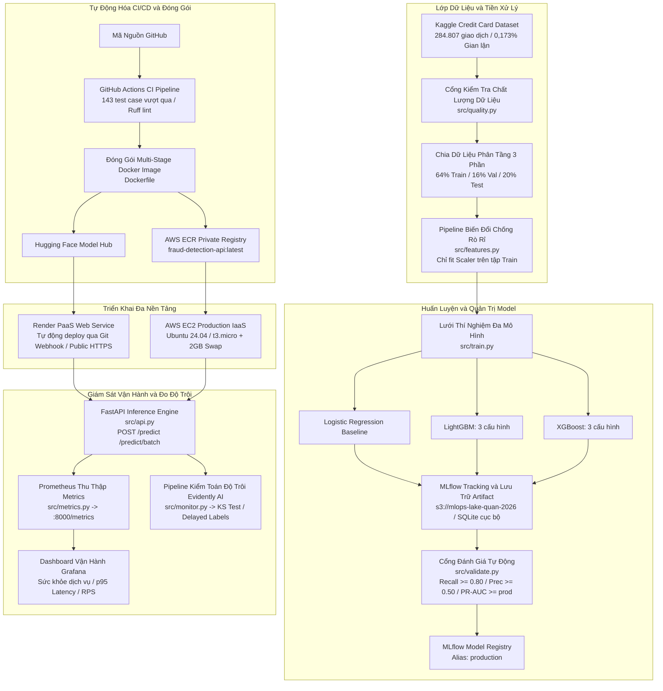

# Hệ Thống MLOps Phát Hiện Gian Lận Thẻ Tín Dụng

[English](README.md) | **Tiếng Việt**

[](https://github.com/anhquan1111/mlops-fraud-detection/actions/workflows/ci.yml)
[](https://www.python.org/downloads/release/python-3120/)
[](tests/)
[](https://github.com/astral-sh/ruff)
[](https://opensource.org/license/mit)
[](https://mlflow.org/)
[](https://fastapi.tiangolo.com/)
[](https://aws.amazon.com/)
[](https://render.com/)

Nền tảng MLOps hoàn chỉnh chuẩn doanh nghiệp cho bài toán **phát hiện gian lận giao dịch thẻ tín dụng thời gian thực** trên tập dữ liệu mất cân bằng nghiêm trọng (~0,173% gian lận trên tổng số 284.807 giao dịch).

Hệ thống được thiết kế chặt chẽ chống rò rỉ dữ liệu (data leakage), quản trị mô hình tự động champion-challenger qua MLflow, phục vụ suy luận thời gian thực với FastAPI (độ trễ dưới 2ms), giao diện dashboard vận hành chuyên nghiệp (Dark/Light theme), hệ thống giám sát toàn diện Prometheus/Grafana, kiểm toán độ trôi dữ liệu với Evidently AI và hỗ trợ triển khai thực tế đa đám mây (Render PaaS + AWS IaaS với S3, ECR và EC2 tối ưu bộ nhớ Swap).

- **Giao diện Dashboard trực tiếp:** [https://mlops-fraud-detection-g7c7.onrender.com](https://mlops-fraud-detection-g7c7.onrender.com)
- **Tài liệu API Swagger OpenAPI:** [https://mlops-fraud-detection-g7c7.onrender.com/docs](https://mlops-fraud-detection-g7c7.onrender.com/docs)

---

## Giao Diện Vận Hành Trực Quan

Hệ thống tích hợp dashboard quản trị chuyên dụng cho đội ngũ vận hành phòng chống gian lận (Fraud SOC), hỗ trợ chấm điểm rủi ro thời gian thực, bóc tách đóng góp của các thuộc tính, giả lập kiểm thử tải hàng loạt và kiểm tra sức khỏe hệ thống.


### Các Tính Năng Chính Trên Dashboard

- **Chấm Điểm Gian Lận & Đồng Hồ Đo Rủi Ro:** Phân tích xác suất tức thì với thang đo trực quan, tự động gán nhãn trạng thái quyết định (`APPROVED` hoặc `BLOCKED`).
- **Phân Tích Đóng Góp Thuộc Tính (Explainability):** Bóc tách trực quan mức độ ảnh hưởng của các đặc trưng quan trọng nhất (bao gồm các thành phần PCA `V14`, `V12`, `V10`, `V4`, `V17` và giá trị `Amount`).
- **Mẫu Giả Lập Tức Thì:** Tích hợp sẵn nút tải mẫu giao dịch chuẩn (Hợp lệ vs Gian lận nguy cơ cao) giúp kiểm thử nhanh mà không cần nhập tay 30 trường dữ liệu.
- **Trình Giả Lập Kiểm Thử Hàng Loạt (Batch Simulator):** Mô phỏng luồng giao dịch đồng thời, thống kê tức thời số lượng duyệt/chặn, tổng giá trị giao dịch và độ trễ phản hồi trung bình.
- **Kiểm Tra Trạng Thái Sức Khỏe Máy Chủ (Health Probe):** Trực tiếp truy vấn các đầu endpoint `/health` và `/ready`, hiển thị chi tiết nguồn model đang nạp, phiên bản và trạng thái bộ nhớ.
- **Chế Độ Giao Diện Sáng / Tối (Dark / Light Mode):** Tùy biến giao diện hiện đại với CSS Variables, ghi nhớ tùy chọn người dùng trên trình duyệt.

---

## Bảng Kết Quả Huấn Luyện & Tuyển Chọn Model

Tất cả mô hình được huấn luyện trên tập train phân tầng (64%, 182.276 dòng) và đánh giá trên tập validation (16%, 45.569 dòng, 79 ca gian lận). Tập kiểm thử độc lập (20%, 56.962 dòng, 98 ca gian lận) chỉ được chấm điểm duy nhất một lần để báo cáo kết quả, tuyệt đối không tham gia vào early stopping, tinh chỉnh tham số hay cổng duyệt thăng cấp.

| Mô hình / Cấu hình | Val PR-AUC | Val Recall | Val Prec | Test PR-AUC | Test Recall | Test Prec | TP | FP | Kết quả Cổng duyệt |
|---|---|---|---|---|---|---|---|---|---|
| `lgbm_large` | 0.8160 | 0.7975 | 0.8289 | 0.8703 | 0.8469 | 0.7615 | 83 | 26 | Từ chối (Recall < 0.80) |
| `lgbm_default` | 0.8038 | 0.8228 | 0.4815 | 0.8496 | 0.8878 | 0.4652 | 87 | 100 | Từ chối (Prec < 0.50) |
| `xgb_default` | 0.7899 | 0.7848 | 0.8267 | 0.8604 | 0.8265 | 0.7714 | 81 | 24 | Từ chối (Recall < 0.80) |
| **`lgbm_regularized`** | **0.7407** | **0.8354** | **0.5238** | 0.7462 | 0.8878 | 0.4555 | 87 | 104 | **Đạt chuẩn (Champion)** |
| `xgb_regularized` | 0.7135 | 0.7848 | 0.4593 | 0.7096 | 0.8571 | 0.4200 | 84 | 116 | Từ chối (Cả 2 tiêu chí) |
| `xgb_deep` | 0.6831 | 0.7342 | 0.5000 | 0.6932 | 0.8061 | 0.4647 | 79 | 91 | Từ chối (Recall < 0.80) |
| Logistic Regression (baseline) | 0.6755 | 0.8861 | 0.0591 | 0.7105 | 0.9082 | 0.0606 | 89 | 1379 | Từ chối (Prec < 0.50) |

### Quản Trị Mô Hình & Nguyên Tắc Không Rò Rỉ Tuyển Chọn

- **Mô hình Champion Production:** `lgbm_regularized` thỏa mãn toàn bộ tiêu chí thăng cấp tự động và được đăng ký trong MLflow Model Registry với alias `production`.
- **Tiêu Chí Cổng Duyệt Tự Động (Validation Gate):**
  - Validation Recall >= 0.80 (bắt giữ tối thiểu 80% các ca gian lận)
  - Validation Precision >= 0.50 (tối thiểu 50% số cảnh báo đưa ra phải là gian lận thật)
  - Validation PR-AUC >= PR-AUC của model đang chạy Production
- **Nguyên Tắc Chống Selection Leakage:** Lưu ý rằng `lgbm_large` có chỉ số trên test set cao nhất (test PR-AUC 0.8703, test Recall 0.8469), nhưng vẫn bị loại do Validation Recall đạt 0.7975 (bắt 63/79 ca, thiếu đúng 1 ca so với mốc sàn 64/79). Việc lấy kết quả test set để can thiệp đè lên cổng duyệt là hành vi rò rỉ tuyển chọn (selection leakage); quy trình MLOps tại đây nghiêm cấm tuyệt đối điều này.

---

## Hiệu Chuẩn Ngưỡng Quyết Định (Decision Threshold)

Ngưỡng quyết định vận hành được kiểm soát qua biến môi trường `DECISION_THRESHOLD` khi khởi động tiến trình. Thay đổi ngưỡng không đòi hỏi sửa code, không cần build lại image và không cần train lại model.

| Ngưỡng vận hành | Test Recall | Test Precision | True Positives | False Positives | False Negatives | Ý nghĩa nghiệp vụ |
|---|---|---|---|---|---|---|
| **0.50** (Mặc định) | 0.8878 | 0.4555 | 87 | 104 | 11 | Điểm vận hành tiêu chuẩn |
| **0.81** (Đề xuất) | 0.8673 | **0.7083** | 85 | **35** | 13 | Giảm 69 ca báo động giả (-66,3%), chặn 85/98 vụ gian lận |

- **Lựa Chọn Khoa Học:** Ngưỡng 0.81 được tối ưu hóa trên tập validation (tối đa hóa Precision với điều kiện Recall >= 0.80) và được kiểm chứng duy nhất một lần trên tập test thông qua script `uv run python scripts/select_threshold.py`.
- **Hiệu Quả Nghiệp Vụ:** Chuyển ngưỡng từ 0.50 lên 0.81 giúp cắt giảm 66,3% khối lượng công việc kiểm tra thủ công của chuyên viên phân tích, chỉ đánh đổi 2 ca gian lận lọt lưới trên tổng số 56.962 giao dịch kiểm thử.

---

## Kiến Trúc Hệ Thống Tổng Thể



---

## Các Trụ Cột Kỹ Thuật MLOps Doanh Nghiệp

### 1. Cơ Chế Triệt Tiêu Rò Rỉ Dữ Liệu (Data Leakage)

Pipeline dữ liệu thiết lập các rào chắn kỹ thuật nghiêm ngặt:
- **Tách Tập Dữ Liệu Phân Tầng Ba Nhánh:** Quy trình cắt riêng tập test (20%) trước tiên, bảo toàn tuyệt đối tỷ lệ gian lận ~0,173% trên toàn bộ các tập. Việc thay đổi tỷ lệ validation không làm dịch chuyển ranh giới của tập test.
- **Fit Scaler Độc Quyền Trên Tập Train:** Bộ chuẩn hóa `Amount` (RobustScaler) chỉ được fit tham số trên 64% dữ liệu train, sau đó áp dụng biến đổi cho validation và test bằng các tham số cố định đó.
- **Tiếp Nhận Dữ Liệu Thô Đúng Thực Tế:** API nhận giá trị `Amount` thực tế chưa chuẩn hóa từ phía client, toàn bộ biến đổi được cô lập an toàn bên trong service pipeline.

### 2. Kiến Trúc Triển Khai Đa Đám Mây (Hybrid Deployment)

Hệ thống hỗ trợ 2 hướng triển khai thực tế độc lập:

#### Hướng A: Render PaaS (Quản lý tự động)
- Triển khai tự động hoàn toàn kích hoạt qua webhook mỗi khi push code lên GitHub thông qua file `render.yaml`.
- Cơ chế nạp model trực tiếp lúc runtime từ kho lưu trữ Hugging Face Hub (`HF_REPO_ID`).
- Hỗ trợ HTTPS công khai, giám sát health check tự động và tự phục hồi khi có sự cố.

#### Hướng B: AWS Enterprise IaaS (Hạ tầng điện toán đám mây riêng)
- **Amazon S3 (`mlops-lake-quan-2026`):** Lưu trữ tập trung các artifact mô hình máy học đã được tuần tự hóa.
- **Amazon ECR (`fraud-detection-api`):** Kho lưu trữ Docker container bảo mật, lưu trữ image multi-stage chạy dưới quyền non-root.
- **Amazon EC2 (`t3.micro`):** Máy chủ điện toán đám mây chạy toàn bộ cụm 3 container (FastAPI, Prometheus, Grafana).
- **Tối Ưu Bộ Nhớ Đệm Swap Trên Linux:** Cấu hình 2.0 GiB bộ nhớ Swap (`/swapfile`) trên ổ cứng 20 GiB EBS gp3. Giải pháp này nâng tổng dung lượng bộ nhớ ảo khả dụng lên ~3.0 GiB, giải quyết triệt để lỗi tràn bộ nhớ (Out-Of-Memory) của nhân Linux khi chạy đồng thời Python, Prometheus và Grafana trên gói Free-Tier `t3.micro`.
- **Phân Quyền Tối Thiểu Qua IAM Instance Profile (`fraud-ec2-role`):** Cấp quyền đọc từ S3 và ECR trực tiếp cho máy chủ EC2, không cần lưu trữ bất kỳ access key nào trên server.

### 3. Hệ Thống Giám Sát và Đo Lường Toàn Diện

Mô hình giám sát sản xuất vận hành trên ba tầng độc lập:

#### Giám Sát Vận Hành (Prometheus & Grafana)
Prometheus liên tục lấy mẫu endpoint `/metrics` mỗi 15 giây, thu thập lưu lượng request, mã trạng thái HTTP, phân phối độ trễ p95/p99 và số lượng giao dịch gian lận bị phát hiện.


Grafana tự động nạp nguồn dữ liệu Prometheus và hiển thị bảng điều khiển 5 chỉ số vận hành quan trọng: tình trạng dịch vụ, thông lượng dự đoán, tỷ lệ lỗi 5xx và số lượng request đang xử lý.


#### Kiểm Toán Độ Trôi Dữ Liệu (Evidently AI)
Phát hiện sự dịch chuyển phân phối xác suất trên từng feature độc lập bằng kiểm định thống kê Kolmogorov-Smirnov và khoảng cách Wasserstein so với dữ liệu phân phối chuẩn lúc train.


#### Kiểm Toán Nhãn Đến Muộn (Delayed-Label Cohort Audit)
Trong thực tế tài chính, nhãn gian lận chỉ xuất hiện sau nhiều ngày hoặc nhiều tuần (khi khách hàng khiếu nại tra soát). Hệ thống triển khai pipeline kiểm toán nhóm thuần tập (`src/monitor.py`), ghép nối nhật ký suy luận lịch sử với nhãn thực tế đến muộn để tính toán độ chính xác vận hành thực tế khi cửa sổ kiểm toán trưởng thành.

---

## Hướng Dẫn Chạy Nhanh

### Yêu Cầu Cài Đặt

- Python 3.12 trở lên
- [uv](https://github.com/astral-sh/uv) (khuyến nghị để quản lý gói cực nhanh) hoặc pip
- Docker & Docker Compose (tùy chọn, để chạy cụm container)

### 1. Clone Mã Nguồn & Cài Đặt Thư Viện

```bash
git clone https://github.com/anhquan1111/mlops-fraud-detection.git
cd mlops-fraud-detection

# Cài đặt toàn bộ dependencies bằng uv
uv sync
```

### 2. Tải Dữ Liệu Huấn Luyện

Tải tệp `creditcard.csv` từ [Kaggle Credit Card Fraud Detection](https://www.kaggle.com/datasets/mlg-ulb/creditcardfraud) và đặt vào thư mục `data/raw/creditcard.csv`:

```bash
# Sử dụng Kaggle CLI
kaggle datasets download -d mlg-ulb/creditcardfraud -p data/raw/ --unzip
```

### 3. Thực Thi Pipeline Huấn Luyện

```bash
# Chạy lưới 7 thí nghiệm mô hình kèm tracking MLflow
uv run python -m src.train
```

### 4. Đánh Giá & Thăng Cấp Mô Hình Tốt Nhất

```bash
# Đánh giá qua cổng kiểm định và đăng ký mô hình champion
uv run python scripts/select_best_model.py
```

### 5. Khởi Chạy Dịch Vụ API

```bash
# Chạy API máy chủ cục bộ với chế độ reload
uv run uvicorn src.api:app --host 0.0.0.0 --port 8000 --reload
```

Truy cập Dashboard tại `http://localhost:8000/` hoặc tài liệu Swagger tại `http://localhost:8000/docs`.

---

## Chạy Cụm Giám Sát Bằng Docker

Khởi chạy đồng thời FastAPI, Prometheus và Grafana bằng Docker Compose:

```bash
# Sao chép cấu hình môi trường
if (-not (Test-Path .env)) { Copy-Item .env.example .env }

# Build và khởi chạy ngầm 3 container
docker compose up -d --build
docker compose ps
```

| Dịch vụ | Địa chỉ truy cập | Mô tả |
|---|---|---|
| **FastAPI Dashboard & Docs** | `http://localhost:8000/docs` | Giao diện dashboard và tài liệu Swagger |
| **Prometheus Targets** | `http://localhost:9090/targets` | Quản lý thu thập telemetry và trạng thái cào dữ liệu |
| **Grafana Dashboard** | `http://localhost:3000` | Bảng điều khiển giám sát (tài khoản: `admin` / `fraud-local-only`) |

Lệnh kiểm tra tình trạng:

```powershell
curl.exe http://127.0.0.1:8000/ready
curl.exe http://127.0.0.1:8000/metrics
docker compose logs --tail=50 api prometheus grafana
```

---

## Chi Tiết Các Endpoint API

### `POST /predict`
Đánh giá mức độ rủi ro gian lận của một giao dịch đơn lẻ.

**Dữ liệu gửi lên (Request):**
```json
{
  "Time": 406.0,
  "V1": -2.31,
  "V2": 1.95,
  "V3": -1.60,
  "V4": 3.99,
  "V5": -0.52,
  "V6": -1.42,
  "V7": -2.53,
  "V8": 1.39,
  "V9": -2.77,
  "V10": -2.77,
  "V11": 3.20,
  "V12": -2.89,
  "V13": -0.59,
  "V14": -4.28,
  "V15": 0.38,
  "V16": -1.14,
  "V17": -2.83,
  "V18": -0.01,
  "V19": 0.41,
  "V20": 0.12,
  "V21": 0.51,
  "V22": -0.03,
  "V23": -0.46,
  "V24": 0.32,
  "V25": 0.04,
  "V26": 0.17,
  "V27": 0.26,
  "V28": -0.14,
  "Amount": 239.93
}
```

**Dữ liệu phản hồi (`HTTP 200 OK`):**
```json
{
  "is_fraud": true,
  "fraud_probability": 0.9412,
  "decision_threshold": 0.5,
  "model_version": "1.0.0"
}
```

### `POST /predict/batch`
Endpoint xử lý hàng loạt với hiệu năng cao, nhận danh sách mảng các đối tượng giao dịch.

### `GET /health`
Liveness probe kiểm tra khả năng sống của dịch vụ, siêu dữ liệu model, nguồn gốc và dung lượng bộ nhớ.

### `GET /ready`
Readiness probe xác nhận trọng số mô hình đã nạp vào bộ nhớ và sẵn sàng nhận request.

### `GET /metrics`
Định dạng metrics chuẩn để Prometheus thu thập dữ liệu định kỳ.

### `GET /reports/latest`
Trả về báo cáo độ trôi dữ liệu HTML mới nhất do Evidently AI tạo ra.

---

## Điểm Chuẩn Độ Trễ & Hiệu Năng Vận Hành

### Độ Trễ Suy Luận Trong Tiến Trình
Đo đạc trên 300 lần lặp sau khi hoàn tất khởi động warm-up (bao gồm kiểm tra Pydantic, tiền xử lý và chấm điểm model; không tính độ trễ mạng):

| Loại yêu cầu | Độ trễ Median | Độ trễ p95 | Chi phí trên mỗi giao dịch |
|---|---|---|---|
| Giao dịch đơn (`POST /predict`) | **1.58 ms** | 2.45 ms | 1.58 ms |
| Lô 10 giao dịch (`POST /predict/batch`) | 2.33 ms | 3.88 ms | 0.233 ms |
| Lô 100 giao dịch (`POST /predict/batch`) | **5.99 ms** | 7.94 ms | **0.060 ms** |

*Ghi chú: Xử lý theo lô giúp tăng thông lượng xử lý lên gấp ~26 lần trên mỗi giao dịch nhờ vector hóa đồng thời toàn bộ DataFrame.*

### Hiệu Năng Khởi Động Container
Đo đạc thực tế khi nạp artifact từ kho từ xa Hugging Face Hub:

| Kịch bản khởi động | Thời gian tải tệp | Thời gian nạp `joblib.load` | Tổng thời gian sẵn sàng |
|---|---|---|---|
| Cold Start (Container mới hoàn toàn) | ~3.5 giây | ~1.3 giây | **~4.8 giây** |
| Warm Start (Đã lưu cache cục bộ) | ~0.1 giây | ~5 ms | **~0.15 giây** |

---

## Kiểm Thử & Đảm Bảo Chất Lượng Phần Mềm

Dự án áp dụng quy trình kiểm thử tự động nghiêm ngặt với 143 ca kiểm thử tự động vượt qua trong vòng 12 giây:

```bash
# Chạy toàn bộ bộ test
uv run pytest tests/ -v

# Kiểm tra phân tích tĩnh code
uv run ruff check src/ tests/ scripts/

# Kiểm tra định dạng code
uv run ruff format --check src/ tests/ scripts/
```

### Kiến Trúc Các Module Kiểm Thử

| Module Kiểm Thử | Phạm vi bao phủ |
|---|---|
| `tests/test_features.py` | Tính toàn vẹn 3 tập phân tầng, đảm bảo Scaler chỉ fit trên Train, không trùng lặp index |
| `tests/test_api.py` | Kiểm định schema Pydantic, từ chối dữ liệu rỗng/vô cực, định dạng phản hồi, health probes |
| `tests/test_config.py` | Kiểm tra nạp biến môi trường, xác thực giới hạn ngưỡng quyết định |
| `tests/test_evaluate.py` | Tính toán chính xác PR-AUC, ROC-AUC, Precision, Recall và F1 trên các trường hợp biên |
| `tests/test_validate.py` | Quy tắc kiểm định mô hình champion-challenger và cổng duyệt thăng cấp |
| `tests/test_quality.py` | Kiểm định miền giá trị giao dịch thô, tính đầy đủ và phát hiện thiếu đặc trưng |
| `tests/test_review_regressions.py` | Bộ rào chắn bảo vệ ngăn chặn tái diễn các lỗi rò rỉ dữ liệu trong quá khứ |
| `tests/test_monitor.py` & `test_monitor_cli.py` | Phát hiện độ trôi đặc trưng, so sánh thống kê với baseline, kiểm toán nhãn muộn |
| `tests/test_metrics.py` | Bộ thu thập số liệu Prometheus, bộ đếm request và histogram độ trễ |
| `tests/test_storage.py` | Lớp trừu tượng lưu trữ AWS S3 và giả lập truyền tải dữ liệu đám mây |

---

## Cấu Trúc Thư Mục Dự Án

```text
mlops-fraud-detection/
|-- compose.yaml                 # Cấu hình Docker Compose (FastAPI + Prometheus + Grafana)
|-- Dockerfile                   # Multi-stage production container image
|-- render.yaml                  # Bản thiết kế triển khai trên Render PaaS
|-- pyproject.toml               # Thông tin dự án và quản lý thư viện uv
|-- .github/
|   `-- workflows/
|       `-- ci.yml               # Pipeline GitHub Actions CI (lint + kiểm thử tự động)
|-- src/                         # Mã nguồn nền tảng chính
|   |-- api.py                   # Ứng dụng FastAPI, định tuyến và phục vụ dashboard
|   |-- config.py                # Cấu hình trung tâm và biến môi trường
|   |-- evaluate.py              # Hàm tính toán các chỉ số đánh giá (PR-AUC, F1, Recall)
|   |-- features.py              # Đọc dữ liệu, chia 3 phần và biến đổi đặc trưng
|   |-- metrics.py               # Thu thập chỉ số Prometheus và middleware đo độ trễ
|   |-- monitor.py               # Kiểm toán độ trôi Evidently và đánh giá nhãn đến muộn
|   |-- quality.py               # Kiểm tra định dạng dữ liệu thô và cổng chất lượng
|   |-- storage.py               # Tiện ích tương tác lưu trữ đám mây AWS S3
|   |-- train.py                 # Pipeline huấn luyện đa mô hình kèm theo dõi MLflow
|   |-- validate.py              # Cổng kiểm định tự động và thăng cấp vào Model Registry
|   `-- templates/
|       `-- dashboard.html       # Giao diện dashboard vận hành doanh nghiệp
|-- monitoring/                  # Cấu hình hệ thống giám sát
|   |-- alerts.yml               # Quy tắc đánh giá cảnh báo của Prometheus
|   |-- prometheus.yml           # Cấu hình cào số liệu từ container API
|   `-- grafana/                 # Cấu hình tự động nguồn dữ liệu và dashboard Grafana
|-- scripts/                     # Các kịch bản tự động hóa vận hành
|   |-- benchmark_latency.py     # Đo đạc điểm chuẩn độ trễ các endpoint
|   |-- benchmark_model_load.py  # Đo đạc thời gian nạp model cold/warm start
|   |-- export_model.py          # Xuất mô hình MLflow thành file pickle độc lập
|   |-- monitor_local.py         # Tạo báo cáo độ trôi Evidently cục bộ
|   |-- select_best_model.py     # Chọn mô hình champion và thăng cấp lên production
|   `-- select_threshold.py      # Tinh chỉnh và kiểm chứng ngưỡng quyết định tối ưu
|-- tests/                       # 143 ca kiểm thử tự động
|-- docs/                        # Tài liệu kiến trúc chuyên sâu
|   |-- architecture.md          # Kiến trúc chi tiết và các quyết định thiết kế
|   |-- leakage_fix.md           # Phân tích nguyên nhân rò rỉ dữ liệu và giải pháp
|   |-- model_card.md            # Bảng thông tin Model Card sản xuất và đạo đức AI
|   |-- review_day4.md           # Hướng dẫn đánh giá mã nguồn và quy trình kiểm thử
|   `-- figures/                 # Sơ đồ kiến trúc và ảnh động demo dashboard
`-- README.md                    # Tài liệu tiếng Anh
```

---

## Các Quyết Định Kỹ Thuật Quan Trọng

| Quyết định chiến lược | Cơ sở kỹ thuật |
|---|---|
| **Chọn PR-AUC làm Metric chính** | Trên tập dữ liệu chỉ có 0,173% nhãn gian lận, ROC-AUC sẽ cho chỉ số cao giả tạo (>0.95) do lượng True Negative áp đảo. PR-AUC tập trung trực diện vào lớp thiểu số gian lận. |
| **Sử dụng `class_weight='balanced'`** | Điều chỉnh trọng số hàm mất mát mà không sinh dữ liệu giả hay bóp méo phân phối, loại trừ nguy cơ rò rỉ dữ liệu thường gặp của SMOTE. |
| **Chia 3 phần độc lập (64/16/20)** | Cắt riêng tập test ngay từ đầu đảm bảo dữ liệu test hoàn toàn mới lạ đối với quá trình early stopping, tìm siêu tham số và cổng duyệt. |
| **Chỉ lựa chọn trên Validation** | Tập test chỉ được tính toán một lần duy nhất để báo cáo. Toàn bộ early stopping và chọn model champion đều diễn ra trên tập validation. |
| **Tách biệt Telemetry và Phân tích Độ trôi** | Giám sát độ trễ dịch vụ (Prometheus) đòi hỏi độ phân giải dưới 1 giây, trong khi phân tích độ trôi dữ liệu (Evidently) cần các cửa sổ thống kê theo lô. Việc tách biệt giúp API suy luận đạt hiệu năng tối đa. |
| **Cấu hình Bộ nhớ Swap trên AWS EC2** | Máy chủ AWS Free-Tier `t3.micro` (1 GB RAM) dễ bị treo nhân hệ điều hành do thiếu RAM khi chạy đồng thời Python, Prometheus và Grafana. 2.0 GiB bộ nhớ Swap là giải pháp an toàn và hoàn toàn miễn phí. |

---

## Tài Liệu Tham Khảo Chuyên Sâu

- [Phân Tích & Khắc Phục Rò Rỉ Dữ Liệu](docs/leakage_fix.md): Báo cáo chi tiết về lỗ hổng rò rỉ dữ liệu, giải pháp khắc phục và đo lường tác động.
- [Thẻ Mô Hình Sản Xuất (Model Card)](docs/model_card.md): Đặc tả chi tiết hiệu năng mô hình, phân tích đường cong ngưỡng và giới hạn vận hành.
- [Thiết Kế Kiến Trúc Hệ Thống](docs/architecture.md): Phân tích sâu về sự đánh đổi kiến trúc, lý do chọn metric và cấu trúc liên kết.
- [Quy Trình Kiểm Thử & Vận Hành](docs/review_day4.md): Hướng dẫn lệnh kiểm chứng từng bước, bằng chứng kiểm thử và phát hiện hồi quy.

---

## Giấy Phép Sử Dụng

Dự án được phân phối dưới giấy phép MIT License - xem chi tiết tại tệp [LICENSE](LICENSE).
