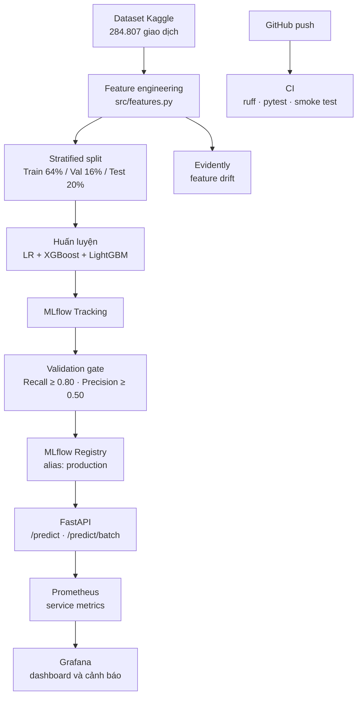

# 🔍 MLOps Fraud Detection Pipeline

[English](README.md) | **Tiếng Việt**

[](https://github.com/anhquan1111/mlops-fraud-detection/actions/workflows/ci.yml)
[](https://www.python.org/downloads/release/python-3120/)
[](https://github.com/astral-sh/ruff)
[](https://opensource.org/license/mit)
[](https://mlflow.org/)
[](https://fastapi.tiangolo.com/)
[](https://mlops-fraud-detection-g7c7.onrender.com)

Pipeline MLOps hoàn chỉnh cho bài toán **phát hiện gian lận thẻ tín dụng theo thời gian thực** trên
tập dữ liệu mất cân bằng nghiêm trọng, với tỷ lệ gian lận khoảng 0,17%. Dự án bao phủ huấn luyện,
theo dõi thí nghiệm, kiểm định và đăng ký model, phục vụ qua API, kiểm tra chất lượng đầu vào,
giám sát drift, metrics hệ thống, container hóa và CI.

🌐 **Dashboard trực tuyến:** [mlops-fraud-detection-g7c7.onrender.com](https://mlops-fraud-detection-g7c7.onrender.com)  
⚡ **Swagger API:** [mlops-fraud-detection-g7c7.onrender.com/docs](https://mlops-fraud-detection-g7c7.onrender.com/docs)

---

## 🎬 Demo


> GIF hiện tại là vị trí dành cho video demo. Có thể thay trực tiếp file
> `docs/figures/demo.gif` mà không cần sửa README.

---

## 📊 Kết quả chính

| Run | val PR-AUC | val Recall | val Precision | test PR-AUC | test Recall | test Precision | TP | FP | Gate |
|---|---:|---:|---:|---:|---:|---:|---:|---:|---|
| `lgbm_large` | 0.8160 | 0.7975 | 0.8289 | 0.8703 | 0.8469 | 0.7615 | 83 | 26 | ❌ recall |
| `lgbm_default` | 0.8038 | 0.8228 | 0.4815 | 0.8496 | 0.8878 | 0.4652 | 87 | 100 | ❌ precision |
| `xgb_default` | 0.7899 | 0.7848 | 0.8267 | 0.8604 | 0.8265 | 0.7714 | 81 | 24 | ❌ recall |
| **`lgbm_regularized`** ⭐ | **0.7407** | **0.8354** | **0.5238** | 0.7462 | 0.8878 | 0.4555 | 87 | 104 | ✅ **champion** |
| `xgb_regularized` | 0.7135 | 0.7848 | 0.4593 | 0.7096 | 0.8571 | 0.4200 | 84 | 116 | ❌ cả hai |
| `xgb_deep` | 0.6831 | 0.7342 | 0.5000 | 0.6932 | 0.8061 | 0.4647 | 79 | 91 | ❌ recall |
| Logistic Regression | 0.6755 | 0.8861 | 0.0591 | 0.7105 | 0.9082 | 0.0606 | 89 | 1379 | ❌ precision |

`lgbm_regularized` được chọn theo `val_pr_auc` và đã đăng ký trong MLflow Registry với alias
`production`. Test split gồm 56.962 giao dịch, trong đó có 98 ca gian lận; tập này chỉ được dùng để
báo cáo sau khi lựa chọn model, không tham gia early stopping, xếp hạng hay validation gate.

Điều kiện vượt gate:

- Recall ≥ 0,80.
- Precision ≥ 0,50.
- PR-AUC không thấp hơn model `production` hiện tại.

`lgbm_large` có kết quả test tốt nhất nhưng validation recall chỉ đạt 0,7975. Với 79 ca gian lận
trong validation split, model bắt đúng 63/79 ca và thiếu đúng một ca để đạt mức hiệu dụng 64/79.
Pipeline vẫn từ chối model này để tránh dùng test set nhằm đảo ngược quyết định đã đưa ra trên
validation set.

> Các chỉ số thấp hơn một số phiên bản README cũ vì hai nguồn data leakage đã được sửa: scaler
> `Amount` từng được fit trước khi chia dữ liệu và test set từng được dùng làm early-stopping watch
> list. Phân tích trước/sau nằm tại [docs/leakage_fix.md](docs/leakage_fix.md).

---

## 🏗️ Kiến trúc



| Thành phần | File | Vai trò |
|---|---|---|
| Feature engineering | `src/features.py` | Đọc dữ liệu, chia train/val/test, fit scaler chỉ trên train |
| Training | `src/train.py` | Chạy 7 cấu hình LR, XGBoost và LightGBM |
| Evaluation | `src/evaluate.py` | PR-AUC, recall, precision, F1, ROC-AUC |
| Validation gate | `src/validate.py` | So sánh candidate với model production |
| API | `src/api.py` | Prediction, health/readiness, metrics và report status |
| Data quality | `src/quality.py` | Kiểm tra schema và chất lượng giao dịch đầu vào |
| Service metrics | `src/metrics.py` | Metrics Prometheus cho HTTP và inference |
| Model monitoring | `src/monitor.py` | Reference profile, feature drift và delayed-label audit |
| Storage | `src/storage.py` | Helper S3 tùy chọn; hạ tầng AWS sẽ cấu hình riêng |

---

## 🚀 Chạy nhanh

### Yêu cầu

- Python 3.12 trở lên.
- [uv](https://docs.astral.sh/uv/).
- Docker Desktop nếu chạy toàn bộ monitoring stack.
- Tài khoản Kaggle nếu muốn huấn luyện lại từ dữ liệu gốc.

### 1. Cài đặt

```bash
git clone https://github.com/anhquan1111/mlops-fraud-detection.git
cd mlops-fraud-detection

uv sync
uv sync --extra dev
```

### 2. Tải dữ liệu

```bash
kaggle datasets download -d mlg-ulb/creditcardfraud -p data/raw/ --unzip
```

Nếu tải thủ công, đặt `creditcard.csv` vào `data/raw/`. Dữ liệu thô được gitignore và không được
commit vào repository.

### 3. Huấn luyện và chọn model

```bash
uv run python src/train.py
uv run python scripts/select_best_model.py
```

Lệnh đầu chạy các thí nghiệm và log vào MLflow. Lệnh thứ hai xếp hạng bằng validation PR-AUC,
áp dụng gate rồi đăng ký model đủ điều kiện.

### 4. Chạy API

```bash
uv run uvicorn src.api:app --reload --port 8000
```

Mở [http://localhost:8000/docs](http://localhost:8000/docs) để thử API bằng Swagger.

### 5. Mở MLflow

```bash
uv run mlflow ui
```

Dashboard MLflow chạy tại [http://localhost:5000](http://localhost:5000).

---

## 📡 API

### `POST /predict`

Dự đoán xác suất gian lận cho một giao dịch.

```bash
curl -X POST http://localhost:8000/predict \
  -H "Content-Type: application/json" \
  -d '{
    "V1": -1.3598, "V2": -0.0728, "V3": 2.5363, "V4": 1.3782,
    "V5": -0.3383, "V6": 0.4624, "V7": 0.2396, "V8": 0.0987,
    "V9": 0.3638, "V10": 0.0908, "V11": -0.5516, "V12": -0.6178,
    "V13": -0.9914, "V14": -0.3112, "V15": 1.4682, "V16": -0.4704,
    "V17": 0.2080, "V18": 0.0258, "V19": 0.4040, "V20": 0.2514,
    "V21": -0.0183, "V22": 0.2778, "V23": -0.1105, "V24": 0.0669,
    "V25": 0.1285, "V26": -0.1891, "V27": 0.1336, "V28": -0.0211,
    "Amount": 149.62
  }'
```

```json
{
  "fraud_probability": 0.003421,
  "is_fraud": false,
  "threshold": 0.5,
  "model_name": "fraud-detection-model@production"
}
```

### `POST /predict/batch`

Nhận tối đa 100 giao dịch trong một request và trả về danh sách prediction cùng tổng số giao dịch
bị đánh dấu gian lận.

### Health và monitoring endpoints

| Endpoint | Mục đích |
|---|---|
| `GET /health` | Trạng thái tiến trình và thông tin model đang phục vụ |
| `GET /ready` | Readiness check cho container/orchestrator |
| `GET /metrics` | Metrics theo định dạng Prometheus |
| `GET /reports/latest` | Trạng thái report monitoring gần nhất |

---

## 🐳 Docker Compose và monitoring

```powershell
# Mặc định dùng models/fraud_model.pkl.
# Nếu file chưa tồn tại, export model và đặt MODEL_FILENAME trong .env.
if (-not (Test-Path .env)) { Copy-Item .env.example .env }

docker compose config --quiet
docker compose up -d --build
docker compose ps
```

| Dịch vụ | URL | Dùng để làm gì |
|---|---|---|
| FastAPI | <http://127.0.0.1:8000/docs> | Gửi request dự đoán |
| Prometheus | <http://127.0.0.1:9090/targets> | Kiểm tra target `fraud-api` và truy vấn metrics |
| Grafana | <http://127.0.0.1:3000> | Xem dashboard `Fraud Detection API - Overview` |

Grafana đọc `GRAFANA_ADMIN_USER` và `GRAFANA_ADMIN_PASSWORD` từ `.env`. Giá trị ví dụ
`admin` / `fraud-local-only` chỉ dành cho máy local. Trong mạng Compose, Prometheus gọi API qua
`api:10000`; cổng `8000` chỉ được bind ra localhost.

### Prometheus

Trang target xác nhận Prometheus scrape thành công endpoint `/metrics` của API.


### Grafana

Dashboard được provision tự động từ Git, gồm trạng thái scrape, request rate, tỷ lệ 5xx, p95
latency theo route và số request đang xử lý. Ảnh dưới đây được chụp từ stack local sau khi gửi
lưu lượng prediction thật.


### Evidently

Prometheus và Grafana trả lời câu hỏi dịch vụ có đang hoạt động tốt hay không. Evidently theo dõi
sự thay đổi phân phối feature theo batch. Khi điều tra, cần kết hợp telemetry hệ thống, drift report
và delayed labels; drift tự nó chưa chứng minh model đã giảm chất lượng.


Các lệnh kiểm tra nhanh:

```powershell
curl.exe http://127.0.0.1:8000/ready
curl.exe http://127.0.0.1:8000/metrics
docker compose exec prometheus promtool check config /etc/prometheus/prometheus.yml
docker compose exec prometheus promtool check rules /etc/prometheus/alerts.yml
docker compose logs --tail=50 api prometheus grafana
```

Dừng stack nhưng giữ dữ liệu dashboard:

```bash
docker compose down
```

`docker compose down --volumes` xóa lịch sử Prometheus cùng user và UI state của Grafana. Dashboard
được provision và alert rules vẫn nằm trong Git. Stack hiện có rule cảnh báo Prometheus nhưng chưa
cấu hình Alertmanager hay kênh nhận thông báo.

---

## 🎚️ Decision threshold

Ngưỡng vận hành được đọc từ biến môi trường `DECISION_THRESHOLD` khi tiến trình khởi động. Có thể
đổi ngưỡng và restart service mà không cần sửa code, build lại image hay train lại model.

| Threshold | Recall | Precision | TP | FP | FN |
|---|---:|---:|---:|---:|---:|
| **0,50** (mặc định) | 0.8878 | 0.4555 | 87 | **104** | 11 |
| **0,81** (phương án đã đo) | 0.8673 | **0.7083** | 85 | **35** | 13 |

Trên test split, tăng ngưỡng từ 0,50 lên 0,81 bỏ sót thêm 2 ca gian lận nhưng giảm 69 cảnh báo sai.
Ngưỡng 0,81 được chọn trên validation split rồi mới kiểm tra đúng một lần trên test split. Dự án
vẫn giữ mặc định 0,50 vì chi phí của một ca gian lận bị bỏ sót so với thời gian điều tra cảnh báo là
quyết định nghiệp vụ.

Tái tạo phép đo bằng:

```bash
uv run python scripts/select_threshold.py
```

---

## ⏱️ Startup và độ trễ

| Kịch bản tải model | Download | `joblib.load` | Tổng |
|---|---:|---:|---:|
| Cold start | khoảng 3,3–4,1 giây | khoảng 1,2–1,4 giây | **khoảng 4,7–5,4 giây** |
| Warm start | khoảng 0,3 giây | khoảng 5 ms | **khoảng 0,3 giây** |

| Endpoint | Median | p95 | Mỗi giao dịch |
|---|---:|---:|---:|
| `POST /predict` (1 giao dịch) | **1,58 ms** | 2,45 ms | 1,58 ms |
| `POST /predict/batch` (10 giao dịch) | 2,33 ms | 3,88 ms | 0,233 ms |
| `POST /predict/batch` (100 giao dịch) | 5,99 ms | 7,94 ms | **0,060 ms** |

Các số inference được đo in-process sau warm-up, gồm validation, preprocessing và inference nhưng
không gồm độ trễ mạng. Batching giảm mạnh chi phí cố định trên mỗi giao dịch.

---

## 🧪 Kiểm thử và chất lượng code

```bash
uv run pytest tests/ -v
uv run ruff check src/ tests/ scripts/
uv run ruff format src/ tests/ scripts/
```

Test suite bao phủ feature engineering, tính độc lập của ba split, scaler chỉ fit trên train,
metrics, validation gate, API schema, cấu hình, data quality, Prometheus metrics, drift monitoring,
CLI và S3 helper bằng mock. Các regression test bảo vệ trực tiếp hai lỗi leakage đã được phát hiện.

---

## 📁 Cấu trúc dự án

```text
mlops-fraud-detection/
├── compose.yaml                 # FastAPI + Prometheus + Grafana
├── src/
│   ├── api.py                   # Prediction và operational endpoints
│   ├── config.py                # Cấu hình trung tâm
│   ├── features.py              # Feature engineering và split
│   ├── train.py                 # Pipeline thí nghiệm
│   ├── evaluate.py              # Metrics đánh giá
│   ├── validate.py              # Validation gate
│   ├── quality.py               # Data quality gate
│   ├── metrics.py               # Prometheus metrics
│   ├── monitor.py               # Drift và delayed labels
│   └── storage.py               # S3 helper tùy chọn
├── scripts/                     # Export, chọn model/ngưỡng, benchmark, monitor CLI
├── tests/                       # Unit và integration tests
├── monitoring/
│   ├── prometheus.yml           # Scrape configuration
│   ├── alerts.yml               # Alert rules
│   └── grafana/                 # Provisioned datasource và dashboard
├── docs/
│   ├── figures/                 # GIF và ảnh monitoring dùng trong README
│   ├── architecture.md
│   ├── leakage_fix.md
│   └── model_card.md
├── Dockerfile
├── pyproject.toml
├── README.md                    # English
└── README.vi.md                 # Tiếng Việt
```

---

## 🎯 Các quyết định thiết kế

| Quyết định | Lý do |
|---|---|
| Dùng PR-AUC làm metric chính | Tập trung vào lớp gian lận hiếm; ROC-AUC dễ tạo cảm giác quá lạc quan trên dữ liệu mất cân bằng |
| `class_weight='balanced'` | Không sinh dữ liệu giả và giảm rủi ro leakage so với dùng SMOTE sai vị trí |
| Giữ Logistic Regression baseline | Đo giá trị thật của boosted trees và giúp phát hiện lỗi pipeline |
| Chia stratified 64/16/20 | Giữ tỷ lệ fraud và cô lập test set khỏi quá trình lựa chọn |
| Chỉ lựa chọn bằng validation | Early stopping, ranking và gate đều không đọc test metrics |
| MLflow Registry với alias | Quản lý version và promotion model có thể tái lập |
| Tách service metrics và data drift | Sự cố vận hành và thay đổi dữ liệu cần tín hiệu cùng cách xử lý khác nhau |

---

## 📋 Dataset

- Nguồn: [Kaggle Credit Card Fraud Detection](https://www.kaggle.com/datasets/mlg-ulb/creditcardfraud).
- Quy mô: 284.807 giao dịch của chủ thẻ châu Âu trong tháng 9/2013.
- Nhãn: 492 fraud và 284.315 giao dịch hợp lệ, tương đương khoảng 0,173% fraud.
- Feature: `Time`, `V1`–`V28` đã PCA và `Amount`; `Time` được loại khỏi pipeline hiện tại.

Dataset đã cũ, ẩn danh và chỉ đại diện cho một lát cắt hẹp. Kết quả trong repo chứng minh quy trình
kỹ thuật trên dataset này, không phải bằng chứng model sẵn sàng xử lý gian lận thực tế ở tổ chức khác.

---

## 📖 Tài liệu

- [Sửa data leakage](docs/leakage_fix.md): nguyên nhân, tác động đo được và các regression test.
- [Model Card](docs/model_card.md): kết quả, threshold, giới hạn và cách sử dụng model.
- [Architecture](docs/architecture.md): lựa chọn metric, xử lý mất cân bằng và thiết kế pipeline.
- [Review ngày 4](docs/review_day4.md): walkthrough code monitoring và lệnh kiểm chứng.
- [AGENTS.md](AGENTS.md): quy ước làm việc với AI agent trong repository.

---

## 🤝 Đóng góp

1. Fork repository và tạo feature branch.
2. Commit theo Conventional Commits: `feat:`, `fix:`, `docs:`, `test:`, `refactor:`, `ci:`.
3. Chạy Ruff và pytest trước khi push.
4. Mở Pull Request, mô tả hành vi thay đổi và cách đã kiểm tra.

---

## 📜 Giấy phép

MIT — xem [MIT License](https://opensource.org/license/mit).
