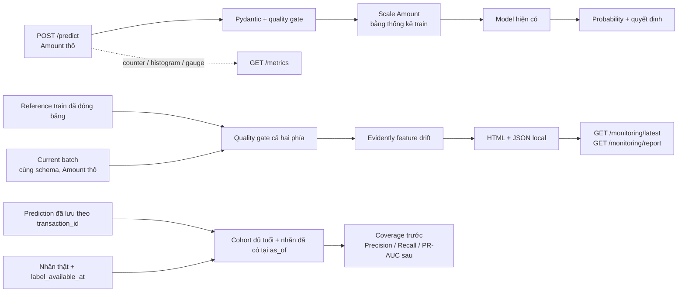

# 🔎 Review & nối kiến thức — Fraud Detection

> **Mốc học: hết Evidently, trước Ngày 5.** Bản cập nhật này tập trung vào tính đúng của API, pytest, cấu hình, logging, Prometheus và Evidently. Mục tiêu là đọc được một luồng hoàn chỉnh rồi tự giải thích được các quyết định trong code.

## 1. Kết luận review

Agent đã đặt đúng các mảnh cơ bản: quality gate, báo cáo Evidently, cohort nhãn trễ và helper S3. Nhưng tích hợp còn lỗi ảnh hưởng trực tiếp đến inference.

| Mức ưu tiên | Lỗi tìm thấy | Đã xử lý |
|---|---|---|
| **Cao** | Quality gate kiểm tra `Amount >= 0` trên Amount **đã scale**: Amount thô 0, 1, 50 đều bị từ chối | Kiểm tra dữ liệu thô trước, sau đó mới scale và gọi model |
| **Cao** | `except Exception` bọc cả `HTTPException(422)` thành 500 | Giữ nguyên lỗi HTTP đã xác định; lỗi nội bộ ghi log và trả thông báo chung |
| **Cao** | Thiếu CSV thì tự tạo baseline ngẫu nhiên; có CSV thì lấy mẫu toàn bộ dữ liệu dù gọi là baseline train | Thiếu nguồn thì báo lỗi; dùng lại `split_data()` để chỉ lấy train, lưu hash và metadata |
| **Vừa** | Reference chưa qua quality gate; tên cột trùng có thể làm gate crash | Kiểm tra cả reference/current; từ chối tên cột trùng và dtype không phù hợp |
| **Vừa** | Lần chạy mới lỗi nhưng HTML cũ vẫn được API phục vụ như báo cáo mới | Công bố RUNNING/SUCCESS/QUALITY_FAILURE/ERROR; chỉ phục vụ HTML khi lần mới nhất SUCCESS |
| **Vừa** | Không thấy feature drift thì kết luận “pipeline healthy” | Chỉ kết luận về feature drift; chất lượng dự đoán cần nhãn |
| **Vừa** | Audit ép nhãn dự đoán về int, có thể biến 0.9 thành 0 | Kiểm tra nhãn nhị phân, ID duy nhất, timestamp, probability trước khi tính điểm |
| **Vừa** | `MLFLOW_TRACKING_URI` trong môi trường CI bị config bỏ qua | Đọc biến môi trường, mặc định vẫn là SQLite local |
| **Vừa** | Test API có thể dùng model thật hoặc tạo stub ngay trong `models/` | Model test nằm trong thư mục tạm, không phụ thuộc Registry hay artifact của bạn |
| **Vừa** | S3 upload mock chỉ giả lập ClientError, bỏ sót lỗi managed uploader | Bắt thêm `S3UploadFailedError`, chỉ kiểm tra bằng mock |

Trước sửa: **108 test có sẵn qua, 1 test bỏ qua; 10 ca tái hiện mới thất bại**. Bộ test cũ chưa thử giao dịch hợp lệ dưới mean của Amount nên không bắt được lỗi quan trọng nhất.

## 2. Luồng code cần hiểu trước



**Hai nhánh riêng về thời điểm chạy:** API dự đoán từng request; job Evidently chạy trên một batch bằng CLI. Không chạy báo cáo Evidently nặng bên trong `/predict`.

**Chưa có cơ chế tự thu gom transaction từ API vào kho lưu trữ.** Job hiện nhận file CSV/Parquet do bạn cung cấp. Audit nhận dự đoán đã lưu tại thời điểm scoring; không tự dựng nhãn hay coi thời gian trong bộ Kaggle là timestamp thực tế của hệ thống bạn. Điều này giữ phần tích hợp vừa sức và minh bạch.

| Kiến thức đã học | File nên đọc | Câu hỏi phải tự trả lời |
|---|---|---|
| Clean Code, exception, pytest | [api.py](../src/api.py), [test_review_regressions.py](../tests/test_review_regressions.py) | Tại sao lỗi dữ liệu là 422, lỗi model là 500, model chưa sẵn sàng là 503? |
| Transform train/serve của project cũ | [config.py](../src/config.py), [features.py](../src/features.py) | Tại sao số âm sau scale là hợp lệ? Mean/std nào được phép dùng khi serving? |
| Ngày 3: metrics và logs | [metrics.py](../src/metrics.py), [test_metrics.py](../tests/test_metrics.py) | Counter khác histogram/gauge ở đâu? Tại sao không dùng transaction_id làm label? |
| Ngày 4: quality và drift | [quality.py](../src/quality.py), [monitor.py](../src/monitor.py) | Tại sao dữ liệu lỗi phải chặn drift? Tại sao cả reference cũng phải kiểm tra? |
| Ngày 4: delayed labels | `matured_cohort_audit()` trong monitor.py | Một giao dịch đủ tuổi nhưng chưa có nhãn được xử lý ra sao? |
| uv, pytest, CI | [pyproject.toml](../pyproject.toml), [ci.yml](../.github/workflows/ci.yml) | Tại sao dùng lockfile? Test đang đọc model nào, ghi vào đâu? |
| AWS/boto3 đã học | [storage.py](../src/storage.py), [test_storage.py](../tests/test_storage.py) | Khởi tạo client có đồng nghĩa đã xác thực thành công chưa? |
| MLflow, DVC đã học | `MLFLOW_TRACKING_URI` và metadata baseline | Để tái lập cần lưu phiên bản code, dependency, data, model và reference nào? |

Metadata baseline lưu SHA-256 của nguồn và artifact, seed split/sample, số dòng và thang Amount. **Hash giúp kiểm tra đúng file, không thay thế việc lưu/version dữ liệu bằng DVC.** Repo hiện chưa có `dvc.yaml`; chưa thêm một pipeline DVC mới trong lần review này.

## 3. Chạy local

### 3.1 Môi trường và API

Chạy từ thư mục gốc repo. Các lệnh chính:

```powershell
uv sync --locked --extra dev --python 3.12
uv run --locked pytest tests/ -q
uv run --locked ruff check src/ tests/ scripts/
uv run --locked ruff format --check src/ tests/ scripts/
```

Môi trường `.venv` Windows tại thời điểm review trỏ tới Python 3.12.4 không còn ở đường dẫn được ghi trong `pyvenv.cfg`. Kiểm chứng lần này dùng **môi trường WSL riêng**, không sửa hoặc xoá venv cũ của bạn. Nếu dùng WSL và Windows cho cùng repo, nên dùng hai venv riêng cho hai hệ điều hành.

Khởi động bằng artifact local hiện có:

```powershell
$env:MODEL_PATH = "models/fraud_model.pkl"
uv run --locked uvicorn src.api:app --host 127.0.0.1 --port 8000 --workers 1
```

Trong WSL:

```bash
MODEL_PATH=models/fraud_model.pkl uv run --locked uvicorn src.api:app --host 127.0.0.1 --port 8000 --workers 1
```

| Endpoint | Ý nghĩa |
|---|---|
| `/docs` | Nhập request và xem schema |
| `/health` | Liveness + trạng thái model; giữ response cũ |
| `/ready` | 200 khi có model, 503 khi chưa thể serving |
| `/metrics` | Dữ liệu scrape cho Prometheus |
| `/monitoring/latest` | Trạng thái lần chạy drift mới nhất; 404 nếu chưa có |
| `/monitoring/report` | HTML của lần chạy thành công mới nhất; 404 khi lần hiện tại chưa thành công |

Startup vẫn fail nếu tải model thất bại. `/ready` bổ sung phép kiểm tra trong lúc process đang chạy; không thay đổi chính sách tải model.

Tên `fraud_model.pkl` chỉ là artifact local đã smoke test. Test này không chứng minh nó trùng với version mang alias `production` trên Registry hoặc model đang chạy trên Render.

### 3.2 Ba thí nghiệm Evidently, không cần AWS

```powershell
uv run --locked python -m scripts.monitor_local demo --scenario stable --output-dir reports/demo-stable
uv run --locked python -m scripts.monitor_local demo --scenario shift --output-dir reports/demo-shift
uv run --locked python -m scripts.monitor_local demo --scenario broken --output-dir reports/demo-broken
```

| Kịch bản | Kết quả đã chạy | Exit code |
|---|---|---|
| Stable: current giống reference | 0/29 feature drift; không đánh giá performance | 0 |
| Shift: dịch chuyển 15 feature | 15/29 feature drift | 0 |
| Broken: Amount có NaN | QUALITY_FAILURE, `drift: null` | 2 |

**Đây là dữ liệu tổng hợp được yêu cầu rõ bằng lệnh `demo`.** Nó không được dùng thay cho baseline thật khi thiếu dữ liệu.

Mở `reports/demo-stable/drift.html` trực tiếp, hoặc cho API đọc cùng thư mục bằng biến môi trường **trước khi khởi động lại**:

```powershell
$env:FRAUD_REPORTS_DIR = "reports/demo-stable"
uv run --locked uvicorn src.api:app --host 127.0.0.1 --port 8000 --workers 1
```

Sau khi thử, bỏ biến này để dùng thư mục mặc định `reports/`: `Remove-Item Env:FRAUD_REPORTS_DIR` trong PowerShell, hoặc `unset FRAUD_REPORTS_DIR` trong Bash.

### 3.3 Reference thật và current thật

```powershell
uv run --locked python -m scripts.monitor_local baseline
uv run --locked python -m scripts.monitor_local drift --current data/processed/current.csv
```

- Lệnh baseline đọc `data/raw/creditcard.csv`, lấy lại **train split 64%**, chọn tối đa 5.000 dòng và giữ Amount thô.
- Ghi `data/processed/reference_baseline.parquet` cùng `reference_baseline.metadata.json`.
- Baseline có metadata/hash hợp lệ thì tải lại, không âm thầm thay bằng dữ liệu hôm nay.
- Baseline cũ không có metadata sẽ bị từ chối. Sau khi xác nhận muốn dựng lại: chạy `baseline --force`. Lệnh này thay baseline, nên phải biết vì sao cần thay.
- `current.csv` cần V1–V28 và Amount thô, không thiếu giá trị, không vô cực, Amount không âm. ID, Time, Class và prediction nếu có **không đi vào drift feature**.
- Lệnh `drift --reference ...` cho phép chỉ định file riêng; lúc đó bạn chịu trách nhiệm chọn đúng provenance và cùng phép biến đổi với current.
- Chỉ chạy **một job ghi vào một output directory tại một thời điểm**. Các lần chạy đè báo cáo của directory đó; muốn lưu lịch sử thì dùng `--output-dir reports/<run-id>`.

KS dùng ngưỡng 0,01 từng feature; dataset drift khi tỷ lệ feature drift ≥ 0,3, tức ít nhất 9/29. Đây là **cấu hình khởi đầu của agent**, chưa hiệu chỉnh theo false alert trên dữ liệu vận hành. Không có cảnh báo không chứng minh model tốt; một feature quan trọng drift vẫn đáng xem dù chưa vượt ngưỡng toàn dataset.

### 3.4 Audit nhãn trễ

Hai file đầu vào:

| File | Cột bắt buộc |
|---|---|
| `scored.csv` | `transaction_id, event_time, prediction`; có thể thêm `fraud_probability` |
| `labels.csv` | `transaction_id, label_available_at, Class` |

```powershell
uv run --locked python -m scripts.monitor_local cohort --scored data/processed/scored.csv --labels data/processed/labels.csv --as-of 2026-09-10T00:00:00Z
```

`prediction` là quyết định 0/1 đã lưu khi scoring, không phải probability. ID phải duy nhất và không null. Timestamp không kèm timezone được diễn giải là UTC; nên ghi ISO 8601 kèm `Z` để rõ nghĩa.

Mặc định chỉ tính giao dịch có `event_time <= as_of - 7 ngày`, chỉ sử dụng nhãn có `label_available_at <= as_of`. Thiếu một nhãn trong cohort đủ tuổi thì trả `insufficient_labels` và `metrics: null`; không điền nhãn thiếu thành 0. Với probability và cả hai lớp trong cohort, báo cáo thêm PR-AUC theo average precision, nhất quán với evaluate.py. Accuracy chỉ là số phụ.

Exit code 0 của audit nghĩa là job chạy được, **không phải quality gate của model đã qua**. Cần đọc status, coverage và metrics.

## 4. Nối Prometheus / Grafana

Stack local thật gồm [compose.yaml](../compose.yaml), [prometheus.yml](../monitoring/prometheus.yml),
[alert rules](../monitoring/alerts.yml) và cấu hình Grafana được provisioning từ Git. Trước khi
chạy, bảo đảm `models/fraud_model.pkl` tồn tại; nếu dùng tên khác, đặt `MODEL_FILENAME` trong
`.env`.

```bash
docker compose config --quiet
docker compose up -d --build
docker compose ps
```

Mở FastAPI tại `http://127.0.0.1:8000/docs`, Prometheus Targets tại
`http://127.0.0.1:9090/targets` và Grafana tại `http://127.0.0.1:3000`. Dashboard
`Fraud Detection API - Overview` cùng Prometheus datasource được tạo tự động. Trong network
Compose, Prometheus scrape `api:10000`; nó không dùng host port `8000`.

Ba truy vấn để tạo panel trong Grafana:

```promql
# Request/giây ở hai endpoint prediction
sum(rate(fraud_http_requests_total{route=~"/predict|/predict/batch"}[5m]))

# Tỷ lệ 5xx; series lỗi chưa xuất hiện thì coi là 0.
# Nếu không có request trong cửa sổ, tỷ lệ không xác định (NaN/no data).
(sum(rate(fraud_http_requests_total{route=~"/predict|/predict/batch",status_class="5xx"}[5m])) or vector(0))
/
sum(rate(fraud_http_requests_total{route=~"/predict|/predict/batch"}[5m]))

# p95 theo route; cộng bucket trước khi tính quantile.
histogram_quantile(
  0.95,
  sum by (le, route) (
    rate(fraud_http_request_duration_seconds_bucket{route=~"/predict|/predict/batch"}[5m])
  )
)
```

Histogram tính theo giây, gồm request handling và inference. Đây không phải latency chỉ của model. Endpoint `/metrics` không tự làm tăng request count. URL không khớp route được gom thành `unmatched`; không gắn ID/feature vào label.

Hai rule `FraudApiDown` và `FraudApiHigh5xxRatio` được Prometheus đánh giá local. Chưa có
Alertmanager nên trạng thái firing không tự gửi email/Slack. Registry metrics nằm trong một
process, dùng `--workers 1` như Dockerfile. Multiworker cần thiết kế thu thập riêng, chưa thêm ở
mốc học này. Counter reset khi restart, nên dùng `rate` thay vì trừ hai giá trị thủ công.

## 5. Kiểm chứng và giới hạn

Kiểm chứng ngày **2026-09-10**, Python 3.12.3 / WSL; dependency theo uv.lock, thêm trực tiếp prometheus-client 0.26.0, giữ Evidently 0.7.21 và pandas 2.3.3:

- **142 passed, 1 skipped**, 68 cảnh báo chủ yếu từ dependency. Test bỏ qua là đối chiếu scaler khi CSV không có trong bản sao test; kiểm tra tương đương đã chạy riêng trên CSV thật 284.807 dòng và **qua**.
- Ruff check và format check qua.
- Cả hai bước smoke CI (tạo dữ liệu tổng hợp, chạy pipeline và validation gate bằng mock) qua trong bản sao riêng.
- Model local `models/fraud_model.pkl` tải được thành LGBMClassifier; batch 5 dòng thật và request Amount 0/1/50 đều trả 200.
- S3 chỉ test bằng mock; không kết nối tài khoản, tạo bucket, deploy hay thay hạ tầng AWS.
- Compose đã build và chạy end-to-end ngày 2026-09-11: API healthy, Prometheus target `fraud-api`
  UP, hai alert rule qua `promtool`, Grafana datasource truy vấn được Prometheus và dashboard đủ
  năm panel. Sáu request `/predict` đã được Prometheus scrape trong smoke test local.
- Không retrain/promote, không đổi decision threshold, không sửa dataset/model/MLflow DB gốc.

Xem [bằng chứng kiểm thử](review_evidence/verification.json). Benchmark cũ `scripts/benchmark_latency.py` chỉ gọi `predict_proba`; không dùng số của nó để khẳng định latency HTTP. Các bảng performance/latency lịch sử trong README chưa được tái xác minh bởi lần review này.

## 6. Cách học từ bản sửa — khoảng 1 buổi

1. **45 phút — API:** đọc `_predict_many` → quality.py → `_build_feature_frame`. Tự tính Amount = 1 sau scale; giải thích vì sao hợp lệ.
2. **45 phút — test:** đọc ca regression rồi dự đoán test nào thất bại nếu đưa gate về vị trí cũ. Thử thay đổi trong branch học riêng.
3. **45 phút — metrics:** gửi request 200/422, xem counter thay đổi; giải thích bucket tích lũy và `rate`.
4. **60 phút — Evidently:** chạy stable/shift/broken; xem cả JSON và HTML. Không coi QUALITY_FAILURE là “không drift”.
5. **45 phút — delayed labels:** dời `label_available_at` sang ngày mai và đoán coverage/metrics trước khi chạy.
6. **30 phút — tự giải thích:** viết 10 câu mô tả luồng project, kèm mỗi câu một function liên quan.

**Để sau:** tự thu gom dữ liệu inference và version cửa sổ báo cáo; DVC pipeline; gói scaler/model thành artifact thống nhất có metadata version; kiểm chứng artifact local trùng Registry; benchmark tải thật; dashboard/alert dựa trên baseline vận hành; AWS IAM/S3/ECR/EC2. Đây là danh sách thiếu còn lại, không phải yêu cầu học thêm tất cả trước khi bắt đầu đọc bản sửa.

## Tài liệu đối chiếu

- [Evidently — Data Drift](https://docs.evidentlyai.com/metrics/preset_data_drift): drift so sánh hai phân phối, không thay thế đánh giá performance.
- [Evidently — Data definition](https://docs.evidentlyai.com/docs/library/data_definition): chỉ định rõ các cột đầu vào được đánh giá.
- [Prometheus — Instrumentation](https://prometheus.io/docs/practices/instrumentation/): chọn metric và kiểm soát số lượng label.
