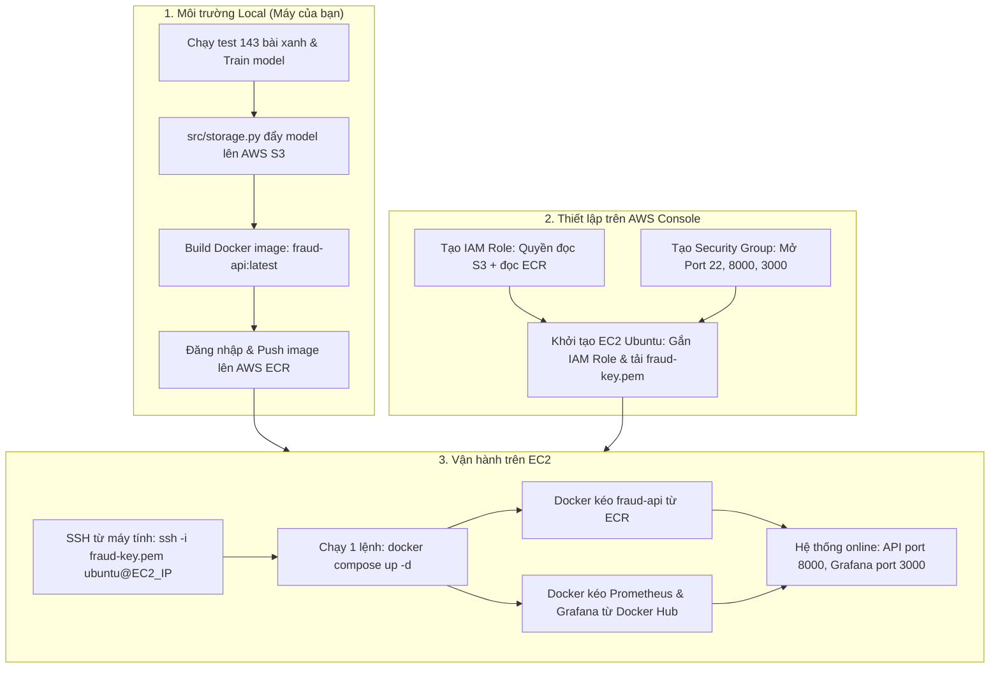
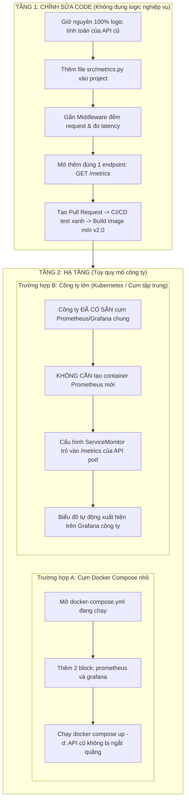

# KIẾN TRÚC HẠ TẦNG & QUY TRÌNH TRIỂN KHAI THỰC CHIẾN: RENDER VÀ AWS

Tài liệu này giải phẫu toàn diện bản chất hạ tầng, cơ chế nhận diện lệnh chạy, quản lý khóa bảo mật (API Key, Credentials), và 2 quy trình triển khai thực tế (từ máy cá nhân lên cloud và tích hợp monitoring trong công ty).

---

## 1. BẢN CHẤT HẠ TẦNG: PAAS VS. IAAS & CƠ CHẾ NHẬN DIỆN LỆNH CHẠY

### 1.1. Phân biệt IaaS, CaaS và PaaS: Bạn quản lý gì và Cloud làm hộ gì?

```
[ Mô hình phân cấp trách nhiệm: Bạn quản lý vs Cloud quản lý ]

+-----------------------------------------------------------------------------------+
| Lớp thành phần          | IaaS (AWS EC2)       | CaaS (AWS ECS)     | PaaS (Render)       |
+-------------------------+----------------------+--------------------+---------------------+
| Ứng dụng & Model ML     | BẠN                  | BẠN                | BẠN                 |
| Dữ liệu (Data)          | BẠN                  | BẠN                | BẠN                 |
| Runtime (Python env)    | BẠN                  | BẠN (qua Docker)   | CLOUD LO HỘ         |
| Container Engine        | BẠN (tự cài Docker)  | CLOUD LO HỘ        | CLOUD LO HỘ         |
| Hệ điều hành (Linux OS) | BẠN (tự vá lỗi apt)  | CLOUD LO HỘ        | CLOUD LO HỘ         |
| Mạng & Cổng Firewall    | BẠN (tự mở Port)     | BẠN (chọn Port)    | CLOUD LO HỘ (HTTPS) |
| Máy chủ vật lý & Ảo hóa | CLOUD LO HỘ          | CLOUD LO HỘ        | CLOUD LO HỘ         |
+-----------------------------------------------------------------------------------+
```

- **IaaS (AWS EC2):** AWS giao cho bạn máy ảo trắng. Bạn tự SSH vào, tự cài Linux package, tự cài Docker, tự mở port firewall. Toàn quyền kiểm soát nhưng tốn công vận hành.
- **CaaS (AWS ECS / Google Cloud Run):** Bạn chỉ đóng gói Docker Image đưa lên ECR. Cloud tự cấp máy ảo ngầm để chạy container và tự động scale.
- **PaaS (Render):** Nền tảng lo trọn gói. Bạn chỉ cần kết nối GitHub repo, Render tự build, tự chạy ngầm, tự cấp domain HTTPS (`*.onrender.com`).

> **Ghi chú về Hugging Face Spaces:**  
> Hugging Face Spaces có bản chất PaaS hoàn toàn tương tự Render (cũng kết nối Git, nạp secret và gọi S3 tương tự). Điểm khác biệt duy nhất: HF Spaces được thiết kế tối ưu cho giao diện tương tác người dùng (Gradio / Streamlit), mặc định cố định ở cổng **7860**, và ít bị rơi vào trạng thái ngủ sâu (sleep) hơn Render.

---

### 1.2. Tại sao Render hay AWS biết chạy container API? Nó đọc ở đâu trong code?

Các nền tảng không tự đoán, chúng đọc chính xác từ một trong hai vị trí:

1. **Khi dùng Docker (Cả Render, AWS EC2, Hugging Face Docker SDK):**
   - Đọc chỉ thị **`CMD`** ở dòng cuối cùng của [Dockerfile](file:///D:/Documents/Project/mlops-fraud-detection/Dockerfile):
     ```dockerfile
     CMD ["sh", "-c", "uvicorn src.api:app --host 0.0.0.0 --port ${PORT:-8000}"]
     ```
   - Lệnh này chỉ định tiến trình chính (PID 1): Mở thư mục `src/`, tệp `api.py`, tìm biến `app = FastAPI()` và khởi chạy web server.
2. **Khi dùng Native Python trên Render (không dùng Docker):**
   - Đọc ô cấu hình **Start Command** trên giao diện web Dashboard của Render do bạn điền:
     `uvicorn src.api:app --host 0.0.0.0 --port $PORT`

---

## 2. QUẢN LÝ KEY VÀ THÔNG TIN XÁC THỰC (CREDENTIALS)

### 2.1. Phân biệt: Token của nền tảng vs. Két sắt chứa Secret bên thứ 3

- **Nhóm 1 - Platform Token:** Do chính nền tảng cấp để xác thực bạn với họ từ dòng lệnh:
  - `HF_TOKEN`: Do Hugging Face cấp để tải model private hoặc push code.
  - `GITHUB_TOKEN`: Do GitHub cấp tự động trong Actions để push Docker image.
- **Nhóm 2 - Secret Vault (Két sắt chứa khóa bên thứ 3):**
  - Bản thân Render hay GitHub **không tự sinh ra key AWS**. Chúng chỉ đóng vai trò là két sắt để bạn cất key của bên khác.
  - Bạn lấy `AWS_ACCESS_KEY_ID` và `AWS_SECRET_ACCESS_KEY` từ AWS IAM, rồi mang sang dán vào mục **Environment** trên Render hoặc mục **Secrets** trên GitHub.

### 2.2. Code đọc các Key đó ở đâu?

Nền tảng tự động biến các key trong két sắt thành biến môi trường hệ điều hành:

1. **Trong Python (Render / EC2):** Đọc bằng thư viện `os`:
   ```python
   import os
   # Vế 1: Tên biến trên Dashboard (bắt buộc khớp 100% từng ký tự hoa/thường)
   # Vế 2: Giá trị mặc định (fallback) nếu không tìm thấy biến
   s3_bucket = os.getenv("AWS_S3_BUCKET", "mlops-fraud-detection-artifacts")
   ```
   > Riêng `boto3.client('s3')` trong [src/storage.py](file:///D:/Documents/Project/mlops-fraud-detection/src/storage.py) đã được AWS lập trình để **tự động quét ngầm** `AWS_ACCESS_KEY_ID` và `AWS_SECRET_ACCESS_KEY` trong môi trường mà không cần bạn truyền thủ công vào hàm.

2. **Trong GitHub Actions (`ci.yml`):** Đọc qua ngữ cảnh secrets:
   ```yaml
   env:
     AWS_ACCESS_KEY_ID: ${{ secrets.AWS_ACCESS_KEY_ID }}
     AWS_SECRET_ACCESS_KEY: ${{ secrets.AWS_SECRET_ACCESS_KEY }}
   ```

3. **Cơ chế IAM Role trên AWS EC2 (Chuẩn Enterprise - Không dùng Key tĩnh):**
   - Trên server production, tuyệt đối không dán Access Key vào file hay biến môi trường.
   - Gắn trực tiếp 1 **IAM Role** vào máy ảo EC2.
   - Thư viện `boto3` tự động gọi IP nội bộ `http://169.254.169.254` (IMDS) để lấy token tạm thời tự xoay vòng mỗi vài tiếng.

---

## 3. QUY TRÌNH 1: TỪ MÁY CÁ NHÂN LÊN CLOUD LẦN ĐẦU (GREENFIELD)

Quy trình bạn tự làm từ đầu đến cuối khi hoàn thành dự án tại máy local:



### Điểm mấu chốt về Docker Compose & ECR:
- **`fraud-api`:** Do bạn tự viết, là mã nguồn nội bộ nên **bắt buộc đẩy lên AWS ECR**.
- **`prom/prometheus` và `grafana/grafana`:** Là phần mềm mã nguồn mở chuẩn quốc tế, có sẵn miễn phí trên **Docker Hub**. Server EC2 tự kéo trực tiếp từ Docker Hub về, **không cần đẩy lên ECR** để tiết kiệm chi phí và thời gian.
- Trong tệp `docker-compose.yml`, mỗi service đều ghi rõ nguồn kéo image:
  ```yaml
  services:
    fraud-api:
      image: <ACCOUNT_ID>.dkr.ecr.ap-southeast-1.amazonaws.com/fraud-api:latest
      ports: ["8000:8000"]

    prometheus:
      image: prom/prometheus:v2.51.0    # Kéo từ Docker Hub
      volumes: ["./monitoring/prometheus.yml:/etc/prometheus/prometheus.yml"]

    grafana:
      image: grafana/grafana:10.4.0       # Kéo từ Docker Hub
      ports: ["3000:3000"]
  ```

---

## 4. QUY TRÌNH 2: TÍCH HỢP MONITORING VÀO HỆ THỐNG CÓ SẴN CỦA CÔNG TY (BROWNFIELD)

Trong môi trường doanh nghiệp, API của công ty đã đang chạy và phục vụ khách hàng. Bạn **không được phép đập đi xây lại** mà tiến hành theo 2 tầng độc lập:



---

## 5. MA TRẬN GIAO TIẾP VÀ CHECKLIST BẢO MẬT ZERO-COST

### 5.1. Ma trận cổng mạng và giao tiếp

| Luồng giao tiếp | Cổng (Port) | Cơ chế xác thực | Điểm đến |
|---|---|---|---|
| **Dev -> EC2 (Quản trị)** | `22` | Khóa bất đối xứng `fraud-key.pem` | Terminal bash của server |
| **Client -> API (Inference)** | `8000` | Token / Public | Endpoint `/predict` |
| **Grafana Dashboard -> Dev** | `3000` | Tài khoản admin Grafana | Web UI Grafana |
| **Prometheus -> API (Scrape)** | `8000` (nội bộ) | Mạng Docker nội bộ | Endpoint `/metrics` |
| **Grafana -> Prometheus** | `9090` (nội bộ) | Mạng Docker nội bộ | Prometheus TSDB |
| **API -> AWS S3 (Artifacts)** | `443` | IAM Role (EC2) hoặc Env Keys (Render) | AWS S3 Bucket |

### 5.2. Nguyên tắc kiểm soát chi phí (Zero-Cost)

- **Trên Render:** Luôn chọn gói **Free Web Service**. Khi không dùng, app tự ngủ (Spin down) và không phát sinh bất kỳ khoản phí nào.
- **Trên AWS:**
  - Chọn instance trong gói Free Tier: `t2.micro` (1 vCPU, 1 GB RAM) hoặc `t3.micro`.
  - Ổ đĩa EBS dưới 30 GB gp3.
  - **Sau khi thực hành xong:**
    - Vào EC2 Console -> **Instance state** -> **Stop instance** (để ngừng tính giờ CPU).
    - Khi kết thúc toàn bộ môn học/dự án: Chọn **Terminate instance** để xóa hẳn máy ảo.
    - Xóa image cũ trên ECR và file rác trên S3 để duy trì dưới ngưỡng 5 GB miễn phí.
