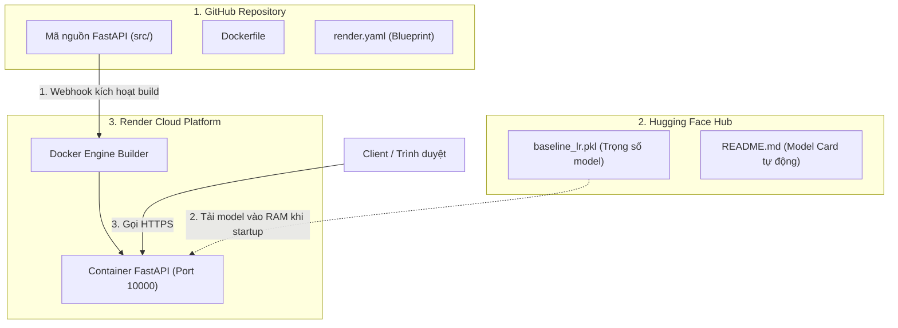
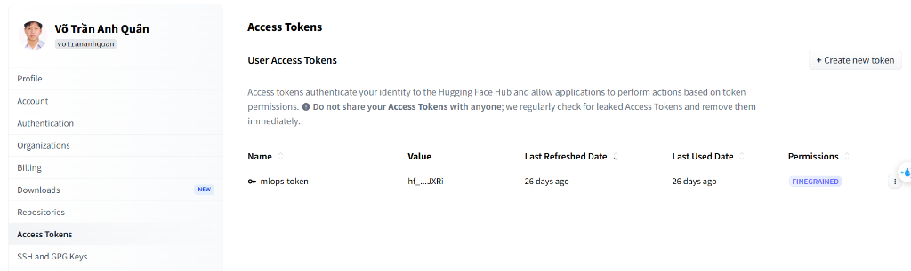

# QUY TRÌNH TRIỂN KHAI HOÀN CHỈNH: HUGGING FACE MODEL HUB & RENDER BLUEPRINT

Tài liệu này hợp nhất toàn bộ quy trình triển khai Chặng 1 của hệ thống MLOps Fraud Detection: Từ xuất và lưu trữ model trên Hugging Face Model Hub, tự động tạo Model Card (README.md), đến triển khai dịch vụ FastAPI lên Render thông qua Blueprint (`render.yaml`) và cơ chế định tuyến endpoint.

---

## 1. TỔNG QUAN KIẾN TRÚC & PHÂN TÁCH TRÁCH NHIỆM

### Sơ đồ luồng dữ liệu kiến trúc



### Nguyên tắc phân tách trách nhiệm:
1. **Model tách rời khỏi Code:** Tệp nhị phân `baseline_lr.pkl` được loại trừ khỏi Git qua `.gitignore` và lưu trữ tĩnh trên Hugging Face Model Hub để tối ưu băng thông và dung lượng repo.
2. **Không cần Token trên Render khi repo Public:** Kho model `votrananhquan/fraud-detection-model` để chế độ Public, cho phép Render tải trọng số về RAM mà không cần cấu hình `HF_TOKEN`. Chỉ khi repo đặt Private mới cần Token.
3. **Render tự động đồng bộ qua GitHub App:** Render kết nối trực tiếp với GitHub Repository. Mỗi khi có commit mới được push, Webhook tự động kích hoạt tiến trình build lại.

---

## 2. PHẦN 1: XUẤT VÀ TẢI MODEL LÊN HUGGING FACE HUB

### 2.1. Xác thực tài khoản với Hugging Face Hub



- **OAuth Device Flow (Khuyến nghị cho máy cá nhân):**
  Chạy lệnh xác thực một lần duy nhất qua trình duyệt:
  ```powershell
  uv run python -c "from huggingface_hub import login; login()"
  ```
  Sau khi bấm **Authorize**, token được tự động lưu vào `C:\Users\Admin\.cache\huggingface\token` để các script Python tự nhận diện.
- **Personal Access Token (Dành cho CI/CD hoặc Cloud Server):**
  Tạo token quyền **Write** tại `https://huggingface.co/settings/tokens` và gán biến môi trường: `$env:HF_TOKEN = "hf_..."`.

---

### 2.2. Phân tích mã nguồn: scripts/export_model.py

Toàn bộ logic lấy model từ MLflow, trích xuất metric kiểm thử và tải lên Hub tập trung tại `scripts/export_model.py`:

#### Khối 1: Lấy model Champion từ MLflow Registry
```python
# 1. Truy vấn Model Registry tìm phiên bản mang alias 'production'
client = MlflowClient(tracking_uri=MLFLOW_TRACKING_URI)
model_version = client.get_model_version_by_alias(REGISTERED_MODEL_NAME, MODEL_ALIAS)

# 2. Tải model nhị phân và lưu ra đĩa cục bộ
model = _load_any_flavor(model_version.source)
LOCAL_MODEL_PATH.parent.mkdir(parents=True, exist_ok=True)
joblib.dump(model, LOCAL_MODEL_PATH)  # Lưu ra models/baseline_lr.pkl (~261 KB)
```

#### Khối 2: Tự động tạo Model Card (README.md) từ metric thật của MLflow
```python
# Đọc metric thực nghiệm từ MLflow Run ID để tránh sai lệch dữ liệu
metrics = _load_run_metrics(model_version.run_id)

card_content = f"""---
language: en
tags:
  - fraud-detection
  - lightgbm
---
# Credit Card Fraud Detection - Champion Model
## Performance (MLflow Run: {model_version.run_id[:8]})
- Validation PR-AUC: {metrics.get('val_pr_auc'):.4f} | Recall: {metrics.get('val_recall'):.4f}
- Test PR-AUC: {metrics.get('test_pr_auc'):.4f} | Recall: {metrics.get('test_recall'):.4f}
"""
```

---

### 2.3. Cơ chế gọi hàm tải lên Hub: api.upload_file()

`api.upload_file()` là phương thức có sẵn của thư viện `huggingface_hub` (lớp `HfApi`), không phải hàm tự viết. Hàm bọc `_upload_to_hf_hub()` trong `scripts/export_model.py` gọi phương thức này 2 lần độc lập:

```python
api = HfApi(token=hf_token)

# LẦN 1: Tải file trọng số mô hình (commit vào Git Hub)
api.upload_file(
    path_or_fileobj=str(model_path),        # Nguồn: tệp local 'models/baseline_lr.pkl'
    path_in_repo=MODEL_ARTIFACT_FILENAME,   # Đích: đặt tên 'baseline_lr.pkl' trên repo
    repo_id=hf_repo_id,                     # Tên kho: 'votrananhquan/fraud-detection-model'
    repo_type="model",                      # Loại kho: model
    commit_message=f"Upload champion model v{model_version.version}",
)

# LẦN 2: Tải file tài liệu Model Card (README.md)
api.upload_file(
    path_or_fileobj=card_content.encode(),  # Nguồn: chuỗi markdown trong RAM đổi ra bytes
    path_in_repo="README.md",               # Đích: đặt tên 'README.md' trên repo
    repo_id=hf_repo_id,                     # Tên kho: 'votrananhquan/fraud-detection-model'
    repo_type="model",                      # Loại kho: model
    commit_message="Add model card",
)
```

#### Ý nghĩa 5 tham số của `api.upload_file()`:
1. **`path_or_fileobj`:** Nguồn dữ liệu (đường dẫn file ổ cứng hoặc luồng bytes trong RAM).
2. **`path_in_repo`:** Đích đến trên Cloud (tên file được lưu trong repo, không phải lệnh tìm file máy tính).
3. **`repo_id`:** Định danh repository (`username/repo-name`).
4. **`repo_type`:** Loại repo trên Hub (`"model"`, `"dataset"`, hoặc `"space"`).
5. **`commit_message`:** Thông điệp commit được ghi vào lịch sử Git của repository.

---

### 2.4. Thực thi và Nghiệm thu trên Hugging Face

```powershell
$env:HF_REPO_ID = "votrananhquan/fraud-detection-model"
$env:PYTHONIOENCODING = "utf-8"
uv run python scripts/export_model.py --upload
```

#### Kết quả hiển thị:
```text
[INFO] Found 'production' model: fraud-detection-model v3 (run_id=176f185e3b684949a2a537f8eb246ee2)
[INFO] Model saved -> models/baseline_lr.pkl (261.2 KB)
[INFO] [OK] Model uploaded to HF Hub: https://huggingface.co/votrananhquan/fraud-detection-model/blob/main/baseline_lr.pkl
[INFO] Model card uploaded.
```

- **Tab Model card:** Hugging Face tự động lấy nội dung file `README.md` render thành giao diện mô tả mô hình và bảng chỉ số.
- **Tab Files and versions:** Hiển thị 3 tệp vật lý trong Git: `.gitattributes`, `README.md`, và `baseline_lr.pkl`.

---

## 3. PHẦN 2: TRIỂN KHAI FASTAPI LÊN RENDER BẰNG BLUEPRINT

### 3.1. Cấu hình hạ tầng: render.yaml

Tệp `render.yaml` định nghĩa toàn bộ hạ tầng triển khai:

```yaml
services:
  - type: web
    name: fraud-detection-api
    runtime: docker
    dockerfilePath: ./Dockerfile
    plan: free
    healthCheckPath: /health
    envVars:
      - key: HF_REPO_ID
        value: votrananhquan/fraud-detection-model
```

- **`name`:** Tên dịch vụ, quyết định tên miền: `https://fraud-detection-api.onrender.com`.
- **`runtime: docker` & `dockerfilePath`:** Yêu cầu Render build ứng dụng từ Dockerfile của dự án.
- **`healthCheckPath: /health`:** Endpoint kiểm tra container sẵn sàng tiếp nhận lưu lượng mạng.
- **`HF_REPO_ID`:** Biến môi trường để hàm `load_model()` trong `src/api.py` tải đúng model từ Hugging Face.

---

### 3.2. Thao tác thiết lập trên Render Dashboard

1. Truy cập [dashboard.render.com](https://dashboard.render.com) -> Chọn **New +** -> **Blueprint**.
2. Kết nối repo: `anhquan1111/mlops-fraud-detection` (Branch: `master`).
3. Điền **Blueprint Name:** `mlops-fraud-detection`, **Blueprint Path:** `render.yaml`.
4. Bấm **Apply**.

---

### 3.3. Tiến trình Build và Khởi chạy theo Dockerfile

Render tự động thực thi tuần tự theo các chỉ thị trong `Dockerfile`:
1. **Build Docker Image:** Kéo base `python:3.12-slim` -> cài thư viện `libgomp1` (chạy LightGBM) -> cài `uv` và chạy `uv sync --frozen --no-dev`.
2. **Khởi chạy Container:** Chạy lệnh `uv run uvicorn src.api:app --host 0.0.0.0 --port 10000`. Khi khởi động, `src/api.py` tự động tải model từ Hugging Face về RAM.
3. **Health Check:** Render gửi yêu cầu `GET /health`, nhận phản hồi `HTTP 200` (`model_loaded: true`) và chuyển trạng thái sang **`Your service is live`**.

---

## 4. PHẦN 3: ĐỊNH TUYẾN MẠNG & KIỂM THỬ DỊCH VỤ

### 4.1. Cơ chế Reverse Proxy và FastAPI Routing

Render cấp 1 URL duy nhất (`https://fraud-detection-api.onrender.com`), nhưng cung cấp được toàn bộ các endpoint nhờ cơ chế phân tách:

- **Render Reverse Proxy (Tầng biên):** Nhận HTTPS tại cổng 443, giải mã SSL/TLS và chuyển tiếp nguyên vẹn đường dẫn URL con (`/docs`, `/health`, `/predict`, `/metrics`) vào container tại cổng 10000.
- **FastAPI Router trong `src/api.py` (Tầng ứng dụng):** Phân tích đường dẫn URL để thực thi hàm tương ứng:
  - `/health` -> Báo cáo trạng thái sống của dịch vụ và tình trạng nạp model.
  - `/docs` -> Trả về giao diện tương tác Swagger UI HTML.
  - `/predict` -> Nhận 29 đặc trưng giao dịch và trả về kết quả dự đoán.
  - `/metrics` -> Xuất số liệu thống kê chuẩn cho máy chủ Prometheus.

---

### 4.2. Hướng dẫn kiểm thử các Endpoint sau khi triển khai

#### 1. Kiểm tra trạng thái hệ thống: `GET /health`
```powershell
curl.exe -s https://fraud-detection-api.onrender.com/health
```
Phản hồi: `{"status":"healthy","model_loaded":true,"model_source":"huggingface_hub","model_flavor":"lightgbm","version":"1.0.0"}`

#### 2. Thử nghiệm dự đoán trực quan qua Swagger UI: `GET /docs`
Mở trình duyệt truy cập: `https://fraud-detection-api.onrender.com/docs` -> Chọn `POST /predict` -> **Try it out** -> Dán dữ liệu 29 đặc trưng và bấm **Execute**.

#### 3. Kiểm thử dự đoán bằng lệnh: `POST /predict`
```powershell
curl.exe -X POST "https://fraud-detection-api.onrender.com/predict" `
  -H "Content-Type: application/json" `
  -d '{"features": [-1.3598, -0.0728, 2.5363, 1.3782, -0.3383, 0.4624, 0.2396, 0.0987, 0.3638, 0.0908, -0.5516, -0.6178, -0.9914, -0.3112, 1.4682, -0.4704, 0.2080, 0.0258, 0.4040, 0.2514, -0.0183, 0.2778, -0.1105, 0.0669, 0.1285, -0.1891, 0.1336, -0.0211, 149.62]}'
```

#### 4. Kiểm tra số liệu giám sát: `GET /metrics`
Truy cập `https://fraud-detection-api.onrender.com/metrics` để kiểm tra các chỉ số `fraud_detection_requests_total` và `fraud_detection_latency_seconds_bucket` phục vụ Prometheus.

---

## 5. BẢNG TỔNG KẾT HỆ THỐNG

| Thành phần | Vai trò | Cơ chế đồng bộ | Ghi chú bảo trì |
|:---|:---|:---|:---|
| **GitHub** | Lưu mã nguồn & Blueprint | Git Push | Không lưu file model `.pkl` |
| **Hugging Face** | Lưu tệp trọng số tĩnh | `scripts/export_model.py --upload` | Tự sinh Model Card từ MLflow Run |
| **Render** | Chạy Container API | Webhook tự động qua Blueprint | Tự động rebuild khi có commit mới |
| **FastAPI** | Xử lý logic & Định tuyến | Router trong `src/api.py` | Cung cấp đầy đủ `/docs`, `/health`, `/predict`, `/metrics` |
